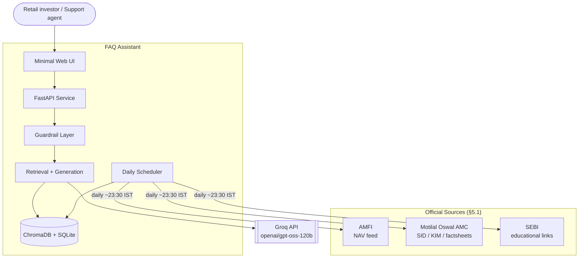
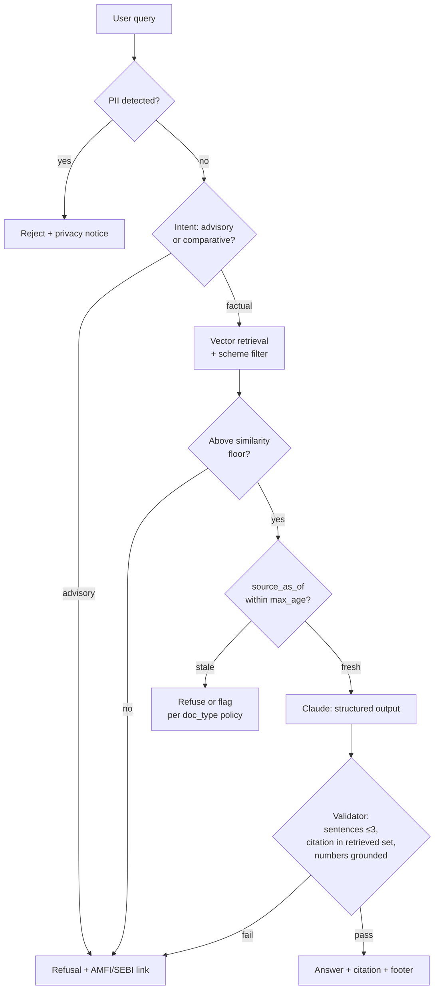
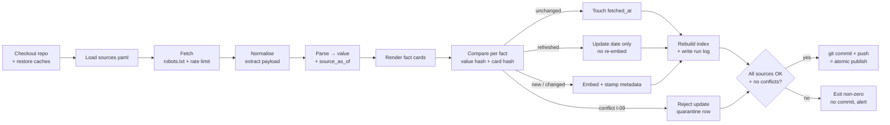

# Architecture: Mutual Fund FAQ Assistant (Facts-Only Q&A)

Derived from [problemStatement.md](problemStatement.md). Section references like §4.5 point back to that document.

---

## 1. Purpose

This document specifies **how** the facts-only mutual fund FAQ assistant is built. The problem statement defines *what* and *why*; this defines components, data flow, storage, guardrails, and the daily refresh pipeline.

**The architecture is shaped by one non-standard requirement:** this system is judged on *refusing correctly* as much as on answering. A conventional RAG stack optimises for helpfulness — retrieve, synthesise, answer. Here, an unsourced or advisory answer is a compliance failure, not a quality miss. That inverts several defaults, which is why the design below puts **deterministic gates around the LLM on both sides** rather than trusting prompt instructions alone.

---

## 2. Design Principles

| # | Principle | Consequence in this design |
|---|---|---|
| P1 | **The LLM never invents a citation** | Citations are drawn from retrieved chunk metadata and validated post-generation against the retrieved set (§7.4). A citation not in that set = refuse. |
| P2 | **Format rules are enforced in code, not requested in a prompt** | Max-3-sentences, exactly-one-citation, and the footer are validated deterministically. The prompt asks; the validator enforces. |
| P3 | **Freshness is a gate, not a display field** | `source_as_of` is checked against `max_age` *before* generation. Stale content is refused or flagged, never silently served (§4.5, §7.3). |
| P4 | **Refusal is a first-class output path** | Not an error case. It has its own schema, template, and educational link — and it is the default when any gate fails. |
| P5 | **Fail closed** | Every ambiguous state — retrieval miss, low similarity, validation failure, stale doc, LLM error — resolves to a refusal, never a best-effort answer. |
| P6 | **PII never enters the system** | Scrubbed at the API boundary before logging, retrieval, or any LLM call (§12). |

---

## 3. Technology Decisions

| Layer | Choice | Rationale |
|---|---|---|
| Language | **Python >=3.11,<3.14** (3.13 in CI) | Best ecosystem for parsing, embeddings, and scheduling. **3.14 is excluded**: `onnxruntime` (a `chromadb` dependency) has no 3.14 wheels, so the dependency set does not resolve. Verified in Phase 1 — do not widen without re-testing. |
| API | **FastAPI + Uvicorn** | Async I/O suits the fetch-heavy scheduler; Pydantic models are reused as the LLM's structured-output schema. |
| Vector store | **ChromaDB** (local persistent) | Embedded, zero infra, metadata filtering on `scheme_id` / `doc_type`, which retrieval depends on. Collection rename gives a cheap atomic swap (§8.4). |
| Retrieval | **Pure vector RAG** | Chosen deliberately — see §6.1 and the risk in §15.1. |
| LLM | **`openai/gpt-oss-120b` on Groq** via the `groq` Python SDK | Free tier. Model choice is effectively forced: the design depends on schema-constrained output, and on Groq **only the GPT-OSS models support strict structured outputs** (Llama 3.3 70B does not). 120B over 20B because the advisory-vs-factual judgment is the hard part of this system. |
| Embeddings | Sentence-transformers (`all-MiniLM-L6-v2`) or a hosted embedding API | Corpus is tiny (~30 docs); local embedding avoids a second vendor and runs in seconds on the daily tick. |
| Scheduler | **GitHub Actions**, daily cron, commits the index to the repo | Free, decoupled from API uptime, single-run guaranteed, and the commit provides atomic publication plus a full audit history (§8.1–8.4). Settles §8.8. |
| UI | Minimal server-rendered page (Jinja2) or Streamlit | §4.4 requires only a welcome message, three examples, and a disclaimer. |
| Metadata / run log | **SQLite** | Document registry, hashes, timestamps, and run history. One file, transactional, no server. |

**Rejected:** LangChain/LlamaIndex abstractions — the pipeline here is short and every stage carries a compliance rule that must be explicit and auditable, not buried in a framework's default chain.

---

## 4. System Context



**Trust boundary:** the assistant reads from official sources and writes nothing back. It has no user accounts, no transactions, and no persistent user state — which is what makes the §5.2 privacy constraints achievable by construction rather than by policy.

---

## 5. Component Architecture

```
mf_faq/
├── api/
│   ├── main.py              # FastAPI app, routes, startup wiring
│   ├── schemas.py           # Pydantic request/response + LLM output models
│   └── ui/                  # Templates: welcome, examples, disclaimer
├── guardrails/
│   ├── pii.py               # PII scrub + reject (§12)
│   ├── intent.py            # Advisory/factual classification (§7.2)
│   ├── freshness.py         # max_age gate on source_as_of (§7.3)
│   └── validator.py         # Post-generation contract enforcement (§7.4)
├── retrieval/
│   ├── embedder.py          # Embedding model wrapper
│   ├── store.py             # ChromaDB client, collection swap
│   └── search.py            # Query → scored chunks + metadata
├── generation/
│   ├── client.py            # Anthropic client construction
│   ├── prompts.py           # System prompt (frozen, cacheable)
│   └── answer.py            # Structured-output call
├── ingest/
│   ├── sources.py           # Source registry (URL, doc_type, parser, max_age)
│   ├── fetch.py             # Polite HTTP, robots.txt, rate limiting
│   ├── parse/               # Per-source-type parsers (HTML, PDF, AMFI NAV)
│   ├── chunk.py             # Chunking + metadata stamping
│   └── pipeline.py          # Orchestrates a full refresh run
├── scheduler/
│   ├── runner.py            # APScheduler setup, daily trigger, manual trigger
│   └── runlog.py            # Run records, alerting on missing updates
└── config/
    ├── sources.yaml         # The 5 schemes and their official source URLs
    └── settings.py          # max_age table, thresholds, model config
```

---

## 6. Retrieval Design

### 6.1 Pure vector RAG — and how it is made safe

Every document — including NAV — is chunked, embedded, and retrieved by semantic similarity. No structured fact table sits alongside the index.

This is simple and conventional, but it carries a real risk for this domain: **the model reads a number off a chunk rather than looking it up from a typed field.** A chunk containing several schemes' expense ratios invites cross-contamination. Three mitigations make it acceptable:

1. **Hard metadata pre-filtering.** Queries resolve to a `scheme_id` first, and the Chroma query is filtered with `where={"scheme_id": ...}` so chunks from other schemes are *not retrievable* for that question. This removes the dominant failure mode — attributing Scheme A's number to Scheme B.
2. **One fact per chunk for numeric fields.** The chunker emits small, single-attribute chunks for numeric facts ("Expense ratio (Direct Growth): 0.62% as of 30-Jun-2026"), rather than one large chunk covering many attributes. Similarity search then returns the specific fact, not a table the model must parse.
3. **Numeric grounding check** (§7.4): every number in the generated answer must appear verbatim in the retrieved chunk text. A number that does not is treated as fabricated → refuse.

Even so, this remains the design's largest accuracy risk — recorded honestly in §15.1 with its upgrade path.

### 6.2 Facts as generated fact cards

Scraped page fragments retrieve badly — a NAV value lifted from a Groww page arrives as a bare number in stray markup, with no surrounding text for a semantic query to match on. The ingestion pipeline therefore **renders each extracted fact as a small natural-language card** before chunking:

```
Scheme: Motilal Oswal Large and Midcap Fund - Direct Growth
Latest declared NAV: ₹31.4782
NAV declaration date: 2026-08-28
Source: Groww scheme page (data republished from the AMC)
```

Cards are embedded like any other document, which does three things at once: it keeps the pipeline uniformly vector-based, it delivers the single-attribute chunks §6.1 depends on, and it gives the embedding model real sentences to work with. The same treatment applies to expense ratio, exit load, minimum SIP, lock-in, and benchmark. (Riskometer is out of corpus — P0.4.)

> **The date shown above is illustrative only. In the implementation, `source_as_of` is NEVER in card text — it lives in chunk metadata (P2.6).**
>
> PS §9 requires this for the page-level-dated facts, whose `nav_date` advances daily regardless of value. Measurement in P2.6 showed the problem is wider: `historic_fund_expense` has `frequency: Daily`, so `expense_ratio`'s date also advances every day — the ELSS ratio held 0.97 for **48 consecutive days** while its date moved each one. A date inside the card would change the text daily, change the hash daily, and re-embed facts that had not moved — the same trap as §8.3, one layer up.
>
> `render_context()` reintroduces the date as a labelled line beside the card at query time, so an answer can state the NAV declaration date (PS §8.7) while the embedding stays stable.

### 6.3 Retrieval parameters

| Parameter | Value | Reason |
|---|---|---|
| `top_k` | 4 | Corpus is small; more context invites cross-attribute confusion. |
| Similarity floor | ~0.35 (tune on the eval set) | Below the floor → **no answer attempted**, refuse (P5). |
| Metadata filter | `scheme_id` when resolvable; `doc_type` when the query maps to one | Prevents cross-scheme leakage (§6.1). |
| Chunk size | 300–500 tokens, single-attribute for numeric facts | Precision over recall. |

---

## 7. The Guardrail Pipeline

This is the core of the system. An answer must pass **every** stage; any failure routes to refusal.



### 7.1 PII gate (pre-everything)

Regex detection for PAN (`[A-Z]{5}[0-9]{4}[A-Z]`), Aadhaar (12-digit), phone, email, and long digit runs (account numbers). On a hit: **reject before logging**, return a privacy notice, and never forward the text to the LLM. §5.2 forbids *processing*, so the check must precede persistence — this ordering is the requirement, not an optimisation.

### 7.2 Intent classification

Two layers, cheap first:

- **Deterministic pre-filter** — advisory phrasings ("should I", "is it good", "which is better", "worth investing", "recommend") short-circuit straight to refusal. Fast, free, and un-jailbreakable for the obvious cases.
- **LLM classification**, folded into the same structured-output call as generation (§7.5) to avoid a second round-trip. The model returns `is_answerable` alongside the answer, so a query that slips past the regex is still caught.

Per §8.4 of the problem statement, objective multi-scheme questions ("which of these is ELSS?") are **allowed**; anything implying ranking or preference is refused. The classifier prompt encodes exactly that boundary.

### 7.3 Freshness gate

Runs **before** generation — there is no point spending a call on a document that cannot legally be quoted.

| `doc_type` | `max_age` (on `source_as_of`) | Past it |
|---|---|---|
| `nav` | 1 business day | **Refuse** + link to AMFI (per §8.6 — a day-old NAV shown as current is simply wrong) |
| `holdings` | 45 days | Flag as potentially outdated |
| `ter`, `riskometer` | 45 days | Flag |
| `sid_kim`, `exit_load`, `benchmark` | 400 days | Flag |
| `process_doc` | 400 days | Flag |

Measured against `source_as_of`, **never** `fetched_at` (§4.5, behaviour 5).

### 7.4 Post-generation validator

Deterministic checks on the structured response:

1. **Sentence count ≤ 3** — split on sentence boundaries, count, reject if over.
2. **Exactly one citation**, and its URL must be in the retrieved chunks' `source_url` set. This is the anti-hallucination backstop (P1).
3. **Numeric grounding** — every numeric token in the answer appears verbatim in retrieved chunk text.
4. **Footer date** equals the `source_as_of` of the cited chunk.
5. **Advisory-language scan** — modal/recommendation phrasing ("you should", "we recommend", "better option") in the output triggers refusal even if the answer is factually sourced.

A validator failure is **not** retried with a nudge; it refuses. Retrying teaches nothing and risks a second bad answer.

### 7.5 Generation call

Format rules are requested via a strict JSON schema, then enforced by §7.4:

```python
import json
from groq import Groq
from pydantic import BaseModel


class FactAnswer(BaseModel):
    is_answerable: bool  # False → advisory, out of scope, or unsupported
    refusal_reason: str | None
    answer: str  # ≤3 sentences, no advice
    citation_url: str  # MUST come from the provided chunks
    source_as_of: str  # ISO date, copied from the cited chunk


client = Groq()  # reads GROQ_API_KEY

response = client.chat.completions.create(
    model="openai/gpt-oss-120b",
    max_tokens=800,
    temperature=0,  # deterministic — this is extraction, not writing
    messages=[
        {"role": "system", "content": FACTS_ONLY_SYSTEM_PROMPT},
        {"role": "user", "content": render_context(chunks, question)},
    ],
    response_format={
        "type": "json_schema",
        "json_schema": {
            "name": "fact_answer",
            "strict": True,  # constrained decoding; requires all fields
            "schema": FACT_ANSWER_SCHEMA,  # additionalProperties: false, all required
        },
    },
)

result = FactAnswer.model_validate_json(response.choices[0].message.content)
```

**Strict-mode requirements:** every property must be listed in `required`, and the schema must set `"additionalProperties": false`. `refusal_reason` is nullable via `{"type": ["string", "null"]}` rather than being optional — strict mode has no optional fields.

**Structured outputs and tool use are mutually exclusive on Groq.** This design uses no tools, so the constraint costs nothing — but it forecloses adding tool use later without dropping schema enforcement.

**The system prompt is a rate-limit cost, not just a token cost.** Groq's free tier has no prompt caching, so the full facts-only policy is re-sent and re-counted on every request against an **8,000 TPM** ceiling (§15.4). This inverts the usual advice: the system prompt must be written *tight* — policy rules as terse directives, not prose, and no few-shot examples unless evaluation proves they earn their tokens.

---

## 8. Scheduler Architecture

Implements §4.5: **one daily run, whole corpus.**

### 8.1 Where it runs — GitHub Actions

**A scheduled GitHub Actions workflow runs the full ingestion pipeline daily and commits the rebuilt index back to the repository.** This settles §8.8 of the problem statement.

This removes the in-process scheduler's two weaknesses outright: refresh no longer depends on API uptime, and the multi-replica double-run problem disappears (a `concurrency` group guarantees one run at a time). It also splits the system cleanly along a boundary it always wanted:

| | Writes the index | Reads the index |
|---|---|---|
| **GitHub Actions** (daily) | ✅ scrape → normalise → chunk → embed → commit | — |
| **FastAPI service** | — | ✅ read-only |

The serving process never writes to Chroma. That single fact eliminates every read/write race the shadow-collection design existed to manage.

**A useful security consequence:** ingestion needs *no* `GROQ_API_KEY`. Embeddings are local (sentence-transformers), and the LLM is only involved at query time. The scheduled workflow therefore holds no model credentials at all — only a repo-scoped write token.

**Trigger:** `cron: '0 18 * * *'` — **18:00 UTC = 23:30 IST**, after AMFI's NAV publication window (§4.5). Cron in Actions is always UTC.

> Actions may delay a scheduled run under load. That is safe here in one direction only: a delayed run fires *later*, never earlier, so it can never run before NAV publishes. A run that slips past midnight IST still records the correct `source_as_of` from the page.

### 8.2 State persistence: the index lives in git

GitHub Actions runners are ephemeral, so the index must be persisted somewhere the next run and the serving process can both reach. **The Chroma directory and SQLite metadata DB are committed to the repository** (`data/chroma/`, `data/registry.db`).

At this scale that is not a workaround — it is the best available option. The corpus is ~30 documents; MiniLM embeddings at 384 dimensions produce a small artifact. In exchange, git provides for free:

- **Atomic publication** — a commit is atomic; there is no half-written index
- **Full version history** of every index the system has ever served
- **One-command rollback** (`git revert`) if a bad parse ships
- **A visible audit trail** — you can diff exactly what changed on any given day, which is a genuinely strong answer to "why did the assistant say that yesterday?"

*If the corpus ever outgrows git* (hundreds of schemes, or large PDFs embedded whole), switch to object storage with a versioned key and have the service pull on boot. The pipeline is unchanged; only the publish step differs.

### 8.2b Pipeline stages



### 8.3 Normalisation before hashing *(measured in P2.3)*

Raw page HTML carries volatile elements that change between fetches and would make every document look "changed", forcing pointless daily re-embedding. **This is confirmed, not hypothetical** — two live fetches of the same Groww page, 4 seconds apart:

| | Result |
|---|---|
| Raw HTML hash | **differs** (identical byte length) |
| Differing characters | **52**, entirely within one Cloudflare `data-cfemail` attribute |
| `mfServerSideData` payload hash | **identical** |

Because facts live in a typed `__NEXT_DATA__` JSON payload (P0.1), normalisation here means **extract the payload and canonicalise it**, not clean up HTML text:

1. Extract `props.pageProps.mfServerSideData` (regex tolerant of attribute order — the `nonce` also rotates, on a slower cycle).
2. Strip PS §5.3-barred fields (`groww_rating`, `analysis`, `peerComparison`, return series) as defence in depth for the P0.4 allowlist.
3. Canonicalise: sorted keys, sorted lists-of-objects, compact separators. List *order* is never the fact here — re-ordered holdings with identical content must not trigger a re-embed.
4. Hash **per fact**, not per page (§8.4b, P2.7) — and per fact, hash the value and the card text separately.

**Change detection then yields one of five outcomes per fact** (`ingest/change.py`):

| Outcome | When | Registry effect | Re-embed |
|---|---|---|---|
| `NEW` | no prior row | insert | yes |
| `UNCHANGED` | value, text and date identical | touch `fetched_at` | no |
| `REFRESHED` | date advanced, value and text identical (I-10) | update the date | **no** |
| `CHANGED` | value or card text moved, date moved too | full update | yes |
| `CONFLICT` | value and date disagree (I-09), or the date regressed | `fetched_at` only; row quarantined `failed` | no |

`REFRESHED` is what makes the daily cadence cheap rather than merely correct. On an ordinary business day, `min_sip` / `lock_in` / `benchmark` (dated by `nav_date`, PS §9) and `expense_ratio` (a Daily-frequency `as_on_date`) all get a new date and no new value — four of seven facts per page, re-dated but not re-embedded. Measured across all five schemes: a NAV-only day embeds **5 of 35** facts.

> **The trap worth naming:** stripping the nonce alone would not work. `data-cfemail` is re-obfuscated on every response, so any scheme that hashes the page — however cleaned — reports a change every day and silently destroys the cost argument for the daily cadence.

### 8.4 Atomic publication: the commit *is* the swap

The shadow-collection + pointer-flip mechanism is **no longer needed**. The workflow rebuilds the index in the runner's ephemeral workspace and commits only on full success:

- **Success** → one commit containing the rebuilt Chroma directory, updated registry, and run log. Atomic by construction.
- **Any source fails** → the job exits non-zero and **commits nothing**. The repository still holds the previous good index, which the serving process is still reading (§4.5, behaviour 3).

There is no window in which a partial index is visible, because the runner's workspace is never what serves traffic.

**Rollback** is `git revert <commit>` — cheaper and more auditable than the retained-collection scheme it replaces.

### 8.4b Workflow definition

```yaml
name: daily-ingest
on:
  schedule:
    - cron: '0 18 * * *'      # 18:00 UTC = 23:30 IST, post-NAV-publication
  workflow_dispatch:           # manual trigger (§8.6)
    inputs:
      scheme_id:
        description: 'Refresh a single scheme (blank = all)'
        required: false

concurrency:                   # never two runs at once
  group: daily-ingest
  cancel-in-progress: false

permissions:
  contents: write              # to commit the index
  issues: write                # to raise an alert issue on failure

jobs:
  ingest:
    runs-on: ubuntu-latest
    timeout-minutes: 30
    steps:
      - uses: actions/checkout@v4
      - uses: actions/setup-python@v5
        with:
          python-version: '3.11'
          cache: pip
      - name: Cache embedding model
        uses: actions/cache@v4
        with:
          path: ~/.cache/huggingface
          key: hf-all-MiniLM-L6-v2      # avoids a ~90MB download every run
      - run: pip install -e .
      - name: Run ingestion
        run: python -m mf_faq.ingest --all ${{ inputs.scheme_id && format('--scheme {0}', inputs.scheme_id) || '' }}
      - name: Commit updated index
        run: |
          git config user.name  "mf-faq-bot"
          git config user.email "actions@github.com"
          git add data/
          git diff --staged --quiet || git commit -m "chore(ingest): refresh corpus $(date -u +%Y-%m-%d)"
          git push
      - name: Raise alert issue on failure
        if: failure()
        uses: actions/github-script@v7
        with:
          script: |
            github.rest.issues.create({
              owner: context.repo.owner, repo: context.repo.repo,
              title: `Daily ingest failed — ${new Date().toISOString().slice(0,10)}`,
              body: `Run: ${context.serverUrl}/${context.repo.owner}/${context.repo.repo}/actions/runs/${context.runId}`,
              labels: ['ingest-failure'],
            })
```

Note `git diff --staged --quiet ||` — on a day when nothing upstream changed there is nothing to commit, and an unconditional `git commit` would fail the job on a **successful** no-op run. That inverted failure signal is exactly what §8.5's alerting must not be polluted with.

### 8.5 Missing-update alerting

Because every source is fetched daily, *absence* of an expected change is a signal (§4.5, behaviour 6):

| Check | Alert when |
|---|---|
| NAV | No new `source_as_of` on a trading day |
| Holdings / riskometer | No new `source_as_of` in 45 days |
| Any source | 3 consecutive fetch failures |
| Educational links | Any non-200 on the AMFI/SEBI links used in refusals |

That last row matters more than it looks: refusal responses are a *required* output path (§4.3), so a dead SEBI link is a broken feature, not a cosmetic issue.

**Delivery.** Actions gives three alerting channels for free, and the design uses all three: a **non-zero exit** turns the run red and emails the repo owner; a **failure issue** (workflow step above) creates a durable, assignable record; and the **run history UI** is a browsable log of every refresh. The SQLite `runs` table is still written and committed — it holds the per-source detail Actions doesn't know about, and it is what `GET /freshness` reads.

**Missing-update checks run inside the pipeline**, not as workflow conditionals — they need the registry to compare `source_as_of` values. The pipeline exits non-zero when one trips, which is what turns it into a GitHub alert.

### 8.6 Manual trigger

**`workflow_dispatch`** on the same workflow, with an optional `scheme_id` input (§4.5, behaviour 7 — needed after a mid-month addendum). One button in the Actions tab, same code path as the scheduled run — the workflow invokes the same CLI a developer does:

```
python -m mf_faq.ingest --all                 # the scheduled run
python -m mf_faq.ingest --scheme mo_elss      # the workflow_dispatch path
python -m mf_faq.ingest --all --dry-run       # preview; writes nothing
python -m mf_faq.ingest --all --json          # what the workflow parses
```

**Exit codes are the publish contract**: `0` every scheme parsed and every fact accepted, `1` a scheme failed or an update was rejected as an I-09 conflict, `2` a usage error. The commit step runs only on `0`. There is deliberately no default target — a bare invocation exits `2` rather than crawling.

This **replaces `POST /admin/refresh`**. An endpoint that mutated the index would reintroduce the write path the §8.1 split just removed, and would need auth for a job the platform already secures with repo permissions.

---

## 9. Data Model

**SQLite — `documents`**

| Column | Notes |
|---|---|
| `doc_id` | PK |
| `scheme_id` | FK; null for AMC-wide docs |
| `doc_type` | `nav`, `ter`, `holdings`, `sid_kim`, `riskometer`, `exit_load`, `benchmark`, `process_doc` |
| `source_url` | The citation link served to users |
| `content_hash` | Hash of the parsed fact **value** — answers *did the fact move?* (§8.3) |
| `card_hash` | Hash of the embedded **card text** — answers *must we re-embed?* Separate from `content_hash` so a card-renderer revision is not mistaken for upstream tampering (P2.7) |
| `source_as_of` | **Drives the footer and the freshness gate** |
| `fetched_at` | Observability only — never user-facing |
| `last_changed_at` | Powers missing-update alerts |
| `status` | `ok` / `failed` / `stale` |

**SQLite — `runs`**: `run_id`, `started_at`, `finished_at`, `status`, `sources_attempted`, `sources_changed`, `sources_failed`, `error_detail`. This table is the evidence behind the freshness claim (§4.5, behaviour 9). (No `collection_name` — §8.4 replaced the pointer-flip with the commit.)

A **"source" here is a fact-document, not a page.** `documents` has one row per fact, each with its own `source_as_of` and freshness policy, so counting pages would hide six of every seven outcomes. `run_id` is `<UTC timestamp>-<6 hex>`: sortable by prefix, and collision-free when two runs land in the same second.

The row is written **before** the work and updated after, so a run that dies mid-flight still leaves a `running` row rather than no evidence at all. Counting rule when a run writes nothing: **every requested fact is `failed`**, including the facts of schemes that parsed cleanly — they did not land either, and reporting them as anything else would imply the registry holds updates it does not (P2.8).

**Chroma — chunk metadata**: `doc_id`, `scheme_id`, `doc_type`, `source_url`, `source_as_of`, `chunk_index`. Every field is needed at query time — `scheme_id`/`doc_type` for filtering, `source_url`/`source_as_of` for the citation and footer.

---

## 10. API Surface

| Endpoint | Purpose |
|---|---|
| `POST /ask` | `{question}` → answer or refusal (`{type, text, citation_url, source_as_of, stale_warning}`) |
| `GET /health` | Liveness + the git SHA of the loaded index |
| `GET /freshness` | Per-`doc_type` `source_as_of` and staleness state — reads the committed run log |
| `GET /` | Minimal UI: welcome, three examples, disclaimer (§4.4) |

---

## 11. Failure Modes

| Failure | Behaviour | Principle |
|---|---|---|
| Source unreachable during run | Job exits non-zero, **nothing is committed**; repo keeps the last good index, failure issue raised | P5 |
| **Scheduled run dropped or delayed by Actions** | No commit that day; the index simply ages. The §7.3 freshness gate catches it — NAV passes `max_age` and starts refusing. **A missed run degrades to refusal, never to wrong answers** | P3, P5 |
| **Workflow disabled after 60 days inactivity** | Silent stop — no runs, no failures, no alerts. See §15.6; this is the one failure mode the pipeline cannot self-report | P3 |
| Parse succeeds but no `source_as_of` found | Document rejected from the index — an uncitable fact is unusable | P3 |
| **Value changed but `source_as_of` did not** (I-09) | **Update rejected**; the previous value keeps standing under its own correct date, the row is quarantined `failed`, and the run exits non-zero. Serving stale-and-honest degrades safely; a new value under an old date breaks the §4.5 guarantee silently. Applies equally to a `source_as_of` that moves backwards | P3, P5 |
| Retrieval below similarity floor | Refuse, offer the official source link | P5 |
| Cited doc past `max_age` | Refuse (NAV) or flag (others) per §7.3 | P3 |
| LLM returns unparseable / schema-invalid output | Refuse; log for eval | P2 |
| Citation not in retrieved set | Refuse; log as a hallucination event | P1 |
| **Groq 429 (TPM/RPM/daily cap)** | Retry with backoff honouring `retry-after`; then a "temporarily unavailable" message — **never** an unsourced fallback answer. Expected in normal operation on the free tier (§15.4), so this path must be user-presentable, not an error page | P5 |
| Groq API error / timeout | Same as above | P5 |

---

## 12. Security & Privacy

- **PII never persisted** — scrubbed at the boundary before logging (§7.1). Query logs store the scrubbed text plus a decision label.
- **No accounts, no session state, no transactions** — the §5.2 constraints hold structurally, not by policy.
- **Two separate allowlists**, enforced in `fetch.py`. Conflating them is how a "fallback" quietly reappears:
  - **Fact allowlist — `groww.in` only.** The ingestion pipeline may fetch nothing else. Any other domain, official or not, is rejected.
  - **Link-health allowlist — `www.motilaloswalmf.com`** (the refusal-link domain; see `config/refusal_links.yaml`), plus any AMFI/SEBI URLs adopted later. Reachable only by the liveness checker (§8.5), which issues a `HEAD` request and stores a status code. It never parses, chunks, embeds, or cites. This is what keeps §4.3's required links working without becoming a fact source.
- **API key** from environment (`GROQ_API_KEY`); never committed.
- **Free-tier data handling** — queries and retrieved chunks are sent to Groq. Chunks are public official data, and the §7.1 PII gate runs *before* any model call, so no personal data leaves the system. Review Groq's free-tier data-retention terms before any non-demo use.
- **Groww is the sole corpus and citation source** (§8.1, decided) — the five scheme pages are fetched, parsed, and cited directly, with no fallback. A fact absent or undated on Groww is out of corpus and refused (§11).
- **Robots.txt compliance is a gating dependency**, not a courtesy. §4.5 behaviour 8 requires it, so `groww.in/robots.txt` must permit `/mutual-funds/` crawling. With no fallback corpus, a disallow is project-blocking.

---

## 13. Testing & Evaluation

| Layer | Approach |
|---|---|
| Unit | Parsers against fixed HTML/PDF fixtures; validator against crafted bad outputs (4 sentences, foreign citation, ungrounded number) |
| Golden set | ~40 factual Q→(expected value, expected source) pairs across all 5 schemes and every in-scope query type |
| Refusal set | ~20 advisory/comparative queries that **must** refuse, including jailbreak-ish phrasings ("hypothetically, which would you pick?") |
| Freshness | Fixture with a backdated `source_as_of` → asserts refuse/flag behaviour fires |
| Scheduler | Simulated unchanged / changed / failing sources → asserts skip, re-embed, and no-swap-on-failure |

The refusal set deserves equal weight to the golden set — under §7 of the problem statement, over-answering is the primary failure mode, and it is the one a helpfulness-tuned system drifts toward.

---

## 14. Configuration

`config/sources.yaml` is the single source of truth for what gets crawled:

```yaml
schemes:
  - scheme_id: mo_large_midcap
    display_name: Motilal Oswal Large and Midcap Fund - Direct Growth
    category: large_and_midcap
    primary_url: https://groww.in/mutual-funds/motilal-oswal-large-and-midcap-fund-direct-growth
    sources:
      # One page yields many doc_types; each is extracted and dated separately.
      # There is no `fallback` key by design — §8.1 permits no other fact source.
      - doc_type: nav
        url: *primary_url
        parser: groww_scheme_page
        extract: nav
        max_age_days: 1
      - doc_type: ter
        url: *primary_url
        parser: groww_scheme_page
        extract: expense_ratio
        max_age_days: 45
      - doc_type: holdings
        url: *primary_url
        parser: groww_scheme_page
        extract: holdings
        max_age_days: 45
```

**Note the shape change from an official-sources design:** one URL now yields many `doc_types`. The fetcher must therefore de-duplicate by URL (fetch each page once per run, not once per fact), while the `documents` registry still tracks each fact separately — each carries its own `source_as_of` and `max_age`, and the page's facts do not all update together.

`config/settings.py` holds the model ID, similarity floor, `top_k`, run time, and the `max_age` defaults.

---

## 15. Known Limitations & Risks

### 15.1 Pure vector retrieval on numeric facts *(largest risk)*

Numbers are read from retrieved text rather than looked up from typed fields. §6.1's mitigations — scheme-level metadata filtering, single-attribute chunks, and numeric grounding validation — reduce but do not eliminate the risk of a misattributed or misread figure.

**Upgrade path if evaluation shows numeric errors:** add a typed `scheme_facts` table populated during ingestion, serve NAV/TER/exit-load/min-SIP from it directly, and keep vector retrieval for prose (statement-download steps, riskometer wording). This is additive — the ingestion pipeline already parses these fields, so it does not require re-architecting.

### 15.2 Single secondary source, no cross-check *(structural)*

Per the §8.1 decision, Groww is the sole fact source. Three consequences follow, and none are mitigable within the current constraint — they are the price of the decision, not defects to fix:

- **Citations are secondary-source.** Groww republishes AMC data; the project cannot claim "official sources only."
- **No verification is possible.** With one source there is nothing to compare against, so a Groww transcription error becomes an assistant error silently. Every other guardrail in §7 checks the answer against the *retrieved chunk* — none can check the chunk against reality.
- **Coverage equals Groww's coverage.** A fact Groww omits or leaves undated is out of corpus and refused (§11), not sourced elsewhere.

If provenance strength later matters more than build simplicity, reopening §8.1 to add AMFI as a NAV cross-check is the smallest useful step — NAV is the highest-churn fact and AMFI publishes it machine-readably.

### 15.3 Client-side rendering risk *(verify in P0)*

Groww scheme pages are a JavaScript application. If NAV and expense-ratio values are injected client-side rather than served in the initial HTML, `httpx` + BeautifulSoup will retrieve an empty shell, and ingestion needs either a headless browser (Playwright — heavier deps, slower runs, more fragile in CI) or Groww's underlying JSON endpoints. **This is the single biggest unknown introduced by the Groww decision** and must be settled in P0 before any parser is written.

### 15.4 Free-tier rate limits are the binding operational constraint

Groq free tier for `openai/gpt-oss-120b`: **30 RPM, 8,000 TPM, 1,000 RPD, 200,000 TPD.**

**TPM binds long before RPM.** A request carries the system prompt + retrieved chunks + output — call it ~2,500–3,000 tokens. At 8,000 TPM that is roughly **2–3 questions per minute**, not 30. Consequences:

- The system prompt must be terse (§7.5) — every token in it is re-spent on every request.
- `top_k=4` chunks is now a rate-limit decision as much as a precision one.
- **A full Phase 5 eval run (~60 queries) costs ~170K tokens — most of the 200K daily budget.** Tuning loops that re-run the eval several times a day are not possible on one free key. Plan for a throttled runner, an overnight schedule, or a subset-eval mode for iteration.

These are demo-scale limits. Any real traffic needs a paid tier.

### 15.5 Compliance judgment on a smaller model

The system's central success criterion is refusal precision (PS §7), and `gpt-oss-120b` is a materially weaker reasoner than a frontier model at the subtle boundary — "hypothetically, which would you pick?" is advisory wearing a disguise.

**The architecture absorbs this better than most.** Determinism carries the load: the regex pre-filter catches obvious advisory phrasing, the validator enforces format and citation integrity mechanically, and the freshness gate is pure date arithmetic. The model is confined to drafting from retrieved text and one classification, with hard gates on both sides — so a weaker model degrades answer *fluency* far more than it degrades *compliance*.

What it cannot absorb is a subtle misclassification that the regex misses. **Phase 5's 100%-refusal gate is the check**, and if `gpt-oss-120b` cannot clear it, the fix order is: strengthen the deterministic pre-filter first (cheap, deterministic, no token cost), tighten the system prompt second, change model last.

### 15.6 GitHub Actions scheduling caveats

Three platform behaviours, one of which is genuinely dangerous for this system:

1. **Scheduled workflows are disabled after 60 days of repository inactivity** (public repos). This is the **worst-shaped failure in the whole design**: it stops the refresh *silently* — no run, no failure, no alert — which is precisely the "silently stale" outcome PS §4.5 exists to prevent. The daily bot commit probably counts as activity, but **do not rely on it**. Mitigations: monitor `GET /freshness` externally, and treat "no green run in 48 hours" as a page. The §7.3 freshness gate is the backstop — the assistant refuses rather than serving stale facts — but refusing everything is still an outage.
2. **Runs can be delayed or dropped under load.** Delay is harmless here (later never precedes NAV publication); a dropped run means the index ages a day and the freshness gate handles it.
3. **Only the default branch's workflow file is scheduled.** A refresh fix on a feature branch does not take effect until merged.

### 15.7 Other limitations

- **Parser brittleness** — a Groww redesign breaks extraction for *all five schemes at once*, since they share one page template. This is more concentrated than the official-sources design, where each source failed independently. Mitigated by fail-loud (§11), but it needs human repair.
- **Single-instance scheduler** (§8.1) — horizontal scaling requires an external cron or a lock.
- **`source_as_of` extraction is heuristic** on pages that don't state a date prominently; such documents are rejected (§11) and become coverage gaps rather than wrong answers.
- **No multi-turn memory** — each question is independent. Follow-ups like "and its exit load?" won't resolve the scheme. A deliberate simplification; revisit only with an explicit scheme-carry-forward design.
- **Corpus is 5 schemes of one AMC** — out-of-corpus questions refuse by design, which is correct but can read as unhelpful.

---

## 16. Traceability

| Requirement | Where it lives |
|---|---|
| §4.2 in-scope query types | §6 retrieval + `doc_type` registry (§9) |
| §4.2 max 3 sentences / 1 citation / footer | §7.4 validator (enforced), §7.5 schema (requested) |
| §4.3 refusal handling | §7.1, §7.2; educational links health-checked in §8.5 |
| §4.4 minimal UI | §10 `GET /` |
| §4.5 daily scheduler | §8 in full |
| §5.1 approved sources (Groww primary, per §8.1) | §12 outbound allowlist; provenance limitation in §15.2 |
| §5.2 privacy | §7.1 PII gate, §12 |
| §5.3 no advice / no performance | §7.2 intent, §7.4 advisory-language scan |
| §5.4 transparency | §7.4 citation + footer validation, `GET /freshness` |
| §8.3 `<date>` semantics | `source_as_of` vs `fetched_at` split (§9) |
| §8.6 stale behaviour | §7.3 policy table |
| §8.8 where scheduler runs | §8.1 (decided: GitHub Actions daily cron, index committed to the repo) |

---

_Facts-only. No investment advice._
