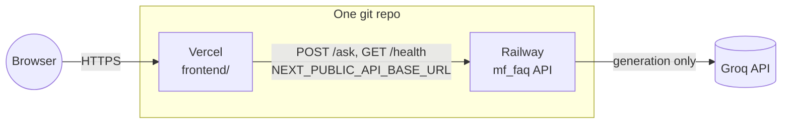

# Deployment

Two separate deployables, matching ARCH §5's split: the **backend** (FastAPI +
the committed RAG index) on **Railway**, the **frontend** (`frontend/`, Next.js)
on **Vercel**. They talk to each other over plain HTTPS — nothing shares a
filesystem or a process.



Read this top to bottom the first time — the two deploys are wired together
(each needs a value produced by the other), so order matters.

---

## 0. Prerequisite: push the repo to GitHub

Neither platform deploys from a local directory; both connect to a git host.
This project is **not yet a git repository** in this working copy, so before
anything else:

```bash
git init
git add .
git commit -m "Initial commit"
```

Then create an empty repository on GitHub (or GitLab/Bitbucket — both
platforms below support all three) and push:

```bash
git remote add origin <your-repo-url>
git branch -M main
git push -u origin main
```

**Before the first commit, check `.env` is not staged** — `git status` should
not list it (it's already in `.gitignore`, but verify: `GROQ_API_KEY` must
never reach a public repo). `data/` **is** meant to be committed — that's the
whole design (ARCH §8.4: "the git commit is the swap"), not an oversight.

---

## 1. Backend on Railway

### 1.1 What ships with the repo already

- **`railway.toml`** (repo root) — tells Railway's Nixpacks builder how to
  start the app: `uvicorn mf_faq.api.main:app --host 0.0.0.0 --port $PORT`,
  with `GET /health` as the health-check path.
- **`.python-version`** (repo root, `3.13`) — Nixpacks reads this to pick the
  interpreter. This pin is load-bearing, not cosmetic: `chromadb`'s
  `onnxruntime` dependency has no Python 3.14 wheels (see
  `implementation-plan.md` Phase 1's finding), so an unpinned build could
  silently pick 3.14 and fail to resolve dependencies.
- **`data/chroma/` and `data/registry.db`**, committed — the backend serves
  directly from what's in the repo. There is no ingestion step at deploy
  time; the corpus is whatever was last committed by `mf-faq-ingest` (locally
  or by the Phase 6 GitHub Actions workflow, once that exists).

### 1.2 Create the Railway service

1. [railway.app](https://railway.app) → **New Project** → **Deploy from GitHub repo** → select this repo.
2. Railway builds from the **repo root** (not `frontend/` — that's Vercel's job). If prompted for a root directory, leave it at `/`.
3. It should auto-detect Nixpacks + Python from `pyproject.toml` and `.python-version`, and read `railway.toml` for the start command. If it instead tries to run `pip install -r requirements.txt` and fails (no such file — this project uses `pyproject.toml`), set the build command explicitly in the service's Settings → Build: `pip install -e .`.

### 1.3 Environment variables

Set these in the Railway service's **Variables** tab:

| Variable | Value | Required |
|---|---|---|
| `GROQ_API_KEY` | your Groq API key | **Yes** — generation fails without it (`Settings.require_groq_key`) |
| `MF_FAQ_CORS_ALLOW_ORIGINS` | `https://<your-vercel-app>.vercel.app` | **Yes**, once you have the Vercel URL (step 2) — see §3 |
| `MF_FAQ_LOG_LEVEL` | `INFO` | No — this is the default |

Everything else (`MF_FAQ_MODEL`, `MF_FAQ_SIMILARITY_FLOOR`, `MF_FAQ_TOP_K`, …)
has a sane default in `mf_faq/settings.py`; only override if you're
deliberately retuning something P5 already tuned.

Do **not** set `PORT` — Railway injects it, and `railway.toml`'s start command
already reads `$PORT`.

### 1.4 First deploy

Trigger a deploy (pushing to the connected branch does this automatically
going forward). Once it's live, Railway gives you a public URL like
`https://your-service.up.railway.app`. Verify:

```bash
curl https://your-service.up.railway.app/health
# {"status":"ok","index_sha":"...","documents":35,"schemes":5,...}
```

If `index_sha` comes back `"unknown"` instead of a short git SHA, Railway's
build didn't preserve `.git` history (see the note under §5) — this is
metadata-only and won't break serving, but it does mean `GET /health` can no
longer tell you which corpus commit is live.

**Cold start note:** the first request after a deploy (or after Railway's
free-tier sleep, if applicable to your plan) pays for loading the embedding
model (~90MB, downloaded from Hugging Face on first use) and building the
Groq client. Subsequent requests are fast — `Searcher`/`AnswerClient` are
lazy singletons (see `mf_faq/api/main.py`), not rebuilt per request.

---

## 2. Frontend on Vercel

### 2.1 Create the Vercel project

1. [vercel.com](https://vercel.com) → **Add New** → **Project** → import the same GitHub repo.
2. **Root Directory: set this to `frontend`** — this is the one setting that must not be left at the repo root, or Vercel will look for a `package.json` at the top level and fail to detect Next.js. (Project Settings → General → Root Directory, or set it during import.)
3. Framework preset should auto-detect as **Next.js**; build/output settings need no overrides.

### 2.2 Environment variable

Project Settings → Environment Variables:

| Variable | Value |
|---|---|
| `NEXT_PUBLIC_API_BASE_URL` | `https://your-service.up.railway.app` (the Railway URL from §1.4, **no trailing slash**) |

Set it for all three environments (Production, Preview, Development) unless
you specifically want previews hitting a different backend. This variable is
baked in at build time (`NEXT_PUBLIC_*` is inlined by Next.js), so **redeploy
the frontend after changing it** — editing the value alone doesn't affect an
already-built deployment.

### 2.3 Deploy

Deploy (or just push to the connected branch). Vercel gives you a URL like
`https://your-app.vercel.app`.

---

## 3. Wire the two together: CORS

The backend only accepts cross-origin requests from origins listed in
`MF_FAQ_CORS_ALLOW_ORIGINS` (`mf_faq/settings.py`, enforced by
`CORSMiddleware` in `mf_faq/api/main.py`). The default list covers `next
dev`'s local ports only — it does **not** include your Vercel domain.

Once you have the Vercel URL from §2.3, go back to Railway's Variables and
set:

```
MF_FAQ_CORS_ALLOW_ORIGINS=https://your-app.vercel.app
```

**Enter a bare URL, or a comma-separated list for more than one** —
`https://your-app.vercel.app,https://your-custom-domain.com`. A JSON array
(`["https://your-app.vercel.app"]`) also still works if you prefer it. What
does **not** work is anything else that merely *looks* like JSON but isn't
valid JSON (a bare `[https://...]` with no quotes, for instance) — that form
used to crash the whole app at boot with a raw `JSONDecodeError` traceback,
because pydantic-settings tried to `json.loads()` the value before validation
ever ran. `mf_faq/settings.py` now parses this field itself (comma-split,
with JSON as a fallback for anyone who already has an array-shaped value), so
the plain-URL form you'd naturally paste into a platform's env var box just
works, and a genuinely malformed JSON-looking value now fails with a message
naming the variable instead of an unreadable stack trace.

Include every origin the frontend can actually be served from — e.g. add a
custom domain here too if you attach one in Vercel. Redeploy the Railway
service for the change to take effect (env var changes require a redeploy,
not just a save).

**Do not set this to `["*"]`.** The comment in `settings.py` is explicit about
why: this API is meant to be called only by a trusted UI, not by arbitrary
origins.

### Preview deployments

Vercel mints a new random-hash URL on every preview deploy
(`rag-agent-fund-project-<hash>-<you>.vercel.app`), so listing them one at a
time in `MF_FAQ_CORS_ALLOW_ORIGINS` doesn't scale — you'd be back in Railway
every time you open a PR. Use the separate regex variable instead, which
`CORSMiddleware` checks in addition to the exact-match list:

```
MF_FAQ_CORS_ALLOW_ORIGIN_REGEX=^https://rag-agent-fund-project(-[a-z0-9]+)*\.vercel\.app$
```

Swap `rag-agent-fund-project` for your actual Vercel project slug. This one
pattern matches both the production domain and every preview URL Vercel ever
generates for this project, without matching anything outside it (verified:
it does **not** match `rag-agent-fund-project.vercel.app.evil.com` or an
unrelated domain — the trailing `$` anchor is load-bearing, don't drop it).
Leave it unset if you don't need preview builds to reach this backend; it
defaults to `None`, which disables this path entirely and falls back to the
exact-match list alone.

---

## 4. Post-deploy verification

Same checks as the local-testing pass, run against the real URLs:

```bash
curl https://your-service.up.railway.app/health
```

Then in the browser, open `https://your-app.vercel.app` and:

- Click a suggestion chip → should return a real, cited, dated answer.
- Ask an advisory question ("Should I buy this fund?") → should refuse
  politely with an Investor Education link, not show the error card.
- Ask about a fund not in the corpus → should list the 5 covered schemes.
- Open the browser devtools Network tab and confirm the `/ask` request
  succeeds (no CORS error in the console — if you see one, §3 wasn't
  completed, or the origin doesn't match exactly, including scheme and
  trailing-slash).

---

## 5. Keeping the corpus fresh in production

Phase 6 (not yet built) automates daily ingestion via GitHub Actions,
committing an updated `data/` on change (ARCH §8.4 — "the git commit is the
swap"). For that to actually reach production, the **serving side must pick
up the new commit** (this is P6.10's open decision). With Railway:

- **Simplest, and the default once you connect the repo:** enable Railway's
  auto-deploy on push to the branch the daily workflow commits to. Every
  ingest commit — daily or manual — triggers a new Railway build and deploy
  automatically. No extra configuration needed beyond what §1.2 already set
  up.
- The alternative (a periodic `git pull` + in-process reload, avoiding a full
  redeploy) is not implemented here and isn't necessary for a service this
  small — a redeploy on a committed index change is exactly the "publish"
  semantics ARCH §8.4 describes.

Until Phase 6 exists, the corpus only updates when you run
`mf-faq-ingest --all` locally and push the resulting `data/` changes
yourself — which redeploys Railway the same way.

**Rollback:** because the index is a git commit, reverting a bad ingest is
`git revert <commit> && git push` — Railway redeploys the previous good
corpus automatically, matching ARCH §8.4's "the repo keeps the previous good
index" guarantee for the serving side too, not just for the Actions workflow.

---

## Known limitations of this setup

- **`index_sha` depends on Railway's build preserving `.git` history.**
  Nixpacks builds do (they clone the full repo), so this should just work —
  but if you ever switch to a Dockerfile-based build that only `COPY`s
  source without `.git`, `GET /health` will report `"unknown"` instead of a
  real SHA (`mf_faq/index_version.py` fails soft by design, so this degrades
  observability, not serving).
- **No external freshness monitor yet** (ARCH §15.6 / P6.11) — if the daily
  ingest workflow silently stops running, nothing here will page anyone.
  Out of scope until Phase 6.
- **Groq's free-tier budget (ARCH §15.4) applies in production exactly as it
  did in local eval** — ~8K TPM, ~200K tokens/day. A public URL getting real
  traffic can exhaust that budget faster than a single developer testing
  locally ever did. `Unavailable` renders as a graceful "temporarily
  unavailable" message when it happens (P4.5b), not a 500, but it does mean
  the service can go quiet under load without warning until Phase 5/6's
  monitoring is extended to cover it.
