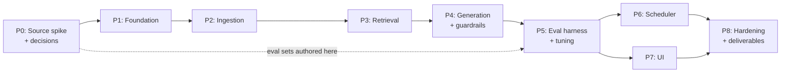

# Implementation Plan: Mutual Fund FAQ Assistant

Phase-wise build plan derived from [problemStatement.md](problemStatement.md) and [architecture.md](architecture.md).
References like PS §4.5 point to the problem statement; ARCH §7 points to the architecture.

---

## Sequencing Strategy

Three decisions shape the order below, and each one is a deliberate departure from the obvious "build it front to back" approach.

**1. The riskiest unknown goes first, before any code.** The entire design assumes that Motilal Oswal / AMFI pages publish each required fact *alongside a discoverable as-of date*. If TER is shown on a page with no date anywhere, the `source_as_of` model (PS §8.3) — which drives the footer, the freshness gate, and the staleness policy — has no input. That is a foundation-level assumption, and finding it false in week three means rebuilding. **Phase 0 is a source-discovery spike whose only job is to confirm or break that assumption.**

**2. The evaluation sets are authored before the prompt.** If the golden and refusal sets are written after the system prompt, they get written *around* the behaviour the prompt already produces — the tests pass because they were shaped to. Authoring them in Phase 0, while reading the official sources anyway, keeps them an independent specification of correct behaviour.

**3. A thin vertical slice completes by Phase 4.** One scheme, one `doc_type`, end to end through every guardrail. Integration problems in a pipeline this gated surface at the seams, and finding them with one document is far cheaper than with thirty.

Durations are indicative for one developer; P6 and P7 are independent and can run in parallel.

---

## Phase 0 — Source Discovery & Decision Spike

**Goal:** Prove the corpus is buildable as designed, and close the open questions that later phases would otherwise hardcode blindly. **No production code.**

**Why first:** Every downstream phase assumes facts + dates exist at stable URLs. This is the cheapest point to discover otherwise.

### Tasks

| # | Task | Output |
|---|---|---|
| **0.0** | **Check `groww.in/robots.txt` permits `/mutual-funds/` crawling** — PS §4.5 behaviour 8 makes this non-negotiable | Go / no-go on the §8.1 decision |
| **0.1** | **Determine whether Groww scheme pages are server-rendered or client-rendered** — `curl` a page and check whether NAV and expense ratio appear in the raw HTML | Decides `httpx` vs. Playwright vs. JSON endpoints (ARCH §15.3) |
| 0.2 | For each of the 5 Groww pages, inventory which in-scope facts are present: NAV, TER, exit load, min SIP, lock-in, riskometer, benchmark, holdings, statement process | Fact coverage matrix |
| 0.3 | For each fact, record whether an as-of date is shown, where, and in what format | `source_as_of` feasibility matrix |
| 0.4 | **Declare the out-of-corpus set** — every in-scope fact Groww omits or leaves undated is refused by design (PS §5.1). Confirm the resulting coverage is acceptable | Signed-off coverage gap list |
| 0.5 | Rate-limit and crawl-delay policy for `groww.in` | Crawl policy note |
| 0.6 | Identify AMFI/SEBI educational links for refusal responses (PS §4.3) — **outbound links only, never fetched for facts** | Refusal link set |
| 0.7 | Author the **golden set** (~40 factual Q→expected value+source) | `eval/golden.yaml` |
| 0.8 | Author the **refusal set** (~20 advisory/comparative/jailbreak queries), **plus out-of-corpus queries from 0.4** | `eval/refusal.yaml` |
| 0.9 | Resolve open questions PS §8.2, §8.6, §8.7 (see below) | Decisions appended to problemStatement.md |

> **0.0 and 0.1 are gating and should be done first, in that order — both are under an hour's work.** With Groww as the sole source (PS §8.1), there is no backup corpus: a robots.txt disallow **blocks the project** and must go back to the stakeholder rather than triggering a fallback. Client-side rendering changes the ingestion stack before a line of parser code is written. An hour spent here protects the entire build.

### Decisions to close here

| Question | Why it must be settled now |
|---|---|
| **PS §8.6** — behaviour past `max_age`: flag vs. refuse | Baked into the Phase 4 freshness gate; changing it later touches guardrails, UI, and eval |
| **PS §8.7** — NAV wording on non-business days | Determines the answer template; retrofitting phrasing after templates exist is churn |
| **PS §8.2** — holdings as verbatim disclosure only | Determines chunking strategy for holdings docs in Phase 2 |

### Exit criteria

- [ ] `groww.in/robots.txt` confirmed to permit the target paths
- [ ] Rendering mode determined; ingestion stack chosen accordingly
- [ ] Every in-scope fact is confirmed present and dated on Groww, **or** is on the signed-off out-of-corpus list
- [ ] Coverage gaps are accepted by the stakeholder — not discovered during eval
- [ ] Golden + refusal sets committed and reviewed
- [ ] The three open questions are decided and written down

### Risks

- **robots.txt disallows crawling** → **project-blocking.** No fallback corpus exists; escalate and reopen PS §8.1.
- **Client-side rendering** (ARCH §15.3) → adds Playwright or JSON-endpoint reverse-engineering; ~1–2 days and ongoing fragility.
- **A fact is absent or undated on Groww** → it is out of corpus and refused (PS §5.1). The risk is not technical but scope: enough gaps and the assistant answers too little to be useful. 0.4 exists to surface that *now*, while the corpus decision is still cheap to revisit.

*Indicative: 2 days (one page per scheme replaces a scattered official-source hunt).*

---

## Phase 1 — Foundation

**Goal:** Runnable skeleton with configuration and storage in place. Nothing intelligent yet.

### Tasks

- 1.1 Repo scaffold per ARCH §5; `pyproject.toml`, pinned deps (`fastapi`, `uvicorn`, `groq`, `chromadb`, `pydantic`, `httpx`, `beautifulsoup4`, `sentence-transformers`). **No `apscheduler`** — scheduling is GitHub Actions (ARCH §8.1)
- 1.2 `config/sources.yaml` populated from the Phase 0 inventory — all 5 schemes, every source, `doc_type`, parser name, `max_age_days`
- 1.3 `config/settings.py` — model ID (`openai/gpt-oss-120b`), similarity floor, `top_k`, run time, `max_age` defaults, **token-budget guardrails**
- 1.4 SQLite schema + migrations: `documents`, `runs` (ARCH §9). **No `active_collection` pointer** — the git commit is the swap (ARCH §8.4)
- 1.5 FastAPI app skeleton with `GET /health` returning the git SHA of the loaded index
- 1.6 Structured logging; `.env.example`; **verify `GROQ_API_KEY` resolution without committing a key**
- 1.7 CI: lint, type-check, pytest

### Exit criteria

- [x] `uvicorn` serves `/health` 200 — returns index SHA, doc count, scheme count, disclaimer
- [x] `sources.yaml` validates against a Pydantic schema at startup — verified by booting with a non-Groww fact URL: **uvicorn exits 3 with `ValidationError: not the permitted fact domain 'groww.in'`**
- [x] Empty DB initialises cleanly from scratch — creates parent dirs, both tables, idempotent
- [x] 38 tests pass; `ruff check` and `ruff format --check` clean; CI workflow added

### ⚠️ Finding: Python 3.14 is unusable — pinned to `>=3.11,<3.14`

`chromadb` depends on `onnxruntime`, which publishes **no Python 3.14 wheels**. `pip install` fails with `ResolutionImpossible`. Verified by dry-run; 3.13 resolves the full stack (chromadb 1.5.9, sentence-transformers 6.0.0, groq 1.7.0, torch 2.11.0).

Caught here rather than in Phase 3 only because P1.1 pinned the *whole* dependency set, not just what Phase 1 needed. `requires-python` and the CI matrix are both pinned to 3.13; do not widen without re-testing.

### Deviation from ARCH §5

Data config (`config/*.yaml`) sits at the repo root rather than inside `mf_faq/`, so the YAML humans review is separate from the Python that loads it. `refusal_links.yaml` was already there from P0.6.

*Indicative: 1 day. **Actual: complete.***

---

## Phase 2 — Ingestion Pipeline

**Goal:** A one-shot CLI that fetches, normalises, hashes, parses, and registers every document. **No scheduler yet** — pipeline correctness first, automation later.

**Phase 2 is complete.** `python -m mf_faq.ingest --all` refreshes the corpus; `--dry-run` previews it; the exit code is what P6 will publish on.

### Tasks

- [x] 2.1 `ingest/fetch.py` — **DONE.** Polite HTTP with robots.txt re-read every run, per-host throttling (honours robots `Crawl-delay` when it exceeds config), identifying UA, retries on 5xx/429/network but **not** 4xx, timeouts, per-run URL de-duplication. 30 offline tests via `httpx.MockTransport`.
- [x] 2.2 **Two allowlists** (ARCH §12) — **DONE.** `fetch()` reaches only `groww.in`; `check_link()` reaches only the refusal-link domains and **returns an `int` status, never a body** — a structural guarantee it cannot become a fact source.
- [x] 2.3 `ingest/normalise.py` — **DONE, scope revised.** The task text assumed HTML scraping; P0.1 found facts live in a typed `__NEXT_DATA__` payload, so normalisation means *extract + canonicalise the payload*, not clean HTML text. Implements: tolerant payload extraction (fails loudly on structure change), barred-field stripping as defence in depth for the P0.4 allowlist, and canonicalisation (sorted keys, sorted lists — re-ordered holdings with identical content is not a change). 31 offline tests.
  **Measured on two live fetches 4s apart:** raw HTML hash **differs** (identical byte length; 52 differing chars, all in one Cloudflare `data-cfemail`), payload hash **identical**, all 7 per-fact hashes stable. Stripping the nonce alone would not have worked.
- [x] 2.4 `ingest/parse/groww_scheme_page.py` — **DONE.** Seven extractors: `nav`, `expense_ratio`, `exit_load`, `holdings`, `min_sip`, `lock_in`, `benchmark`. **No `riskometer`** — this task's text predates P0.4, which declared it out of corpus (`nfo_risk` and `return_stats[].risk` disagree, neither is dated). Includes the I-06 redirect guard: `search_id` is verified against the URL slug *before* any extraction, since filing one fund's data under another's `scheme_id` would pass every downstream guardrail.
- [x] 2.5 **`source_as_of` per fact** — **DONE.** Per-fact date strategies from the P0.3 matrix; facts with no extractable, parseable, non-future date are dropped with a logged reason (ARCH §11).
  **⚠️ Timezone bug caught here:** `holdings[].portfolio_date` is `2026-07-30T18:30:00.000Z` — 18:30 UTC is **00:00 IST on 31 July**, the month-end disclosure date. Naive parsing yields 30 July: off by one *and* on the wrong month-end. Timezone-aware values convert to IST; naive values (`2026-08-28T00:00:00`) are already IST-local and are not shifted.
  **Live run:** 35/35 facts extracted across all 5 schemes, 0 unavailable.
- [x] 2.6 `ingest/fact_card.py` — **DONE.** Each fact renders as one natural-language sentence naming its scheme exactly once (the name is what a semantic query matches on; repeating it wastes tokens re-sent against the 8K TPM ceiling on every retrieval). Holdings are **one card**, verbatim names + weights, no commentary (PS §8.2, R-08). `render_context()` assembles retrieved cards for the LLM. 38 offline tests.
  **⚠️ The PS §9 date constraint is broader than stated.** `historic_fund_expense` has `frequency: Daily` — the ELSS expense ratio held **0.97 for 48 consecutive days while `as_on_date` advanced every one of them**. So `expense_ratio` churns on date alone, exactly like the three page-level facts. Adopted rule: **the date is never in card text, for any fact — metadata only.** `render_context()` reintroduces it as a labelled line beside the card, so an answer can state the NAV declaration date (PS §8.7) while the embedding stays stable.
- [x] 2.7 `ingest/change.py` — **DONE.** Per-fact hash compare with five outcomes: `NEW`, `UNCHANGED` (touch `fetched_at`), `REFRESHED`, `CHANGED`, `CONFLICT`. Detection is pure; application is a single transaction. 30 offline tests.
  **Two hashes per fact, not one.** `content_hash` holds the parsed *value* and answers "did the fact move?"; a new `card_hash` column holds the embedded *sentence* and answers "must we re-embed?" (schema v1 → v2, migrated in place). Collapsing them would make any card-renderer reword look like upstream tampering across all 35 facts at once — the exact signature of the I-09 alarm below.
  **`REFRESHED` is what makes the daily cadence cheap.** min_sip / lock_in / benchmark are dated by `nav_date` (PS §9) and `expense_ratio` by a Daily-frequency `as_on_date` (P2.6), so on an ordinary business day four of seven facts per page get a new date and no new value. They are re-dated, not re-embedded.
  **⚠ Edge case I-09 was still open and is decided here: reject + alert.** A value that moves while its date stands still would be served under a stale footer, breaking the one guarantee PS §4.5 exists to protect. The registry keeps the previous value under its own correct date, quarantines the row `status='failed'`, and surfaces it in `ChangeSummary.conflicts` for P2.8 to exit non-zero on. A `source_as_of` that moves *backwards* is treated identically. Both are sticky — they recur every run until resolved, so neither can be lost to one overlooked log line.
  **Measured across a simulated four-day run of all 5 schemes (fixtures, no network):** day 1 → 35 new, 35 embedded; day 2, corpus unchanged → **0 changed, 0 embedded**; day 3, NAV moves on every scheme → 5 changed (the NAVs), 15 refreshed, 15 unchanged, **5 embedded**; day 4, expense ratio moved under a frozen `as_on_date` → **5 conflicts, 0 written**.
- [x] 2.8 `ingest/pipeline.py` — **DONE.** `run(scheme_ids=None)` drives fetch → normalise → parse → cards → compare → `documents`, returns a `RunReport` with an exit code. The `Fetcher` is injectable, so all 22 tests drive the *whole* pipeline over `httpx.MockTransport` with no network.
  **The registry write is all-or-nothing across schemes.** Cards are collected from every scheme first and reconciled in one transaction. If any scheme fails, nothing is written — not even the four that succeeded. This is the local mirror of ARCH §8.4: a red run skips the commit step, so writing the partial result on a laptop while CI discards it would make the two environments disagree about what a failed run leaves behind. Implements the standing S-03 rule; does not settle the edge case.
  **The run log is written either way**, in its own transactions before and after the document write. A failed run that leaves no evidence of failing is worse than useless — `runs` is what `GET /freshness` reads.
  **⚠️ A counting flaw the tests caught:** `sources_failed` originally counted only the broken scheme's 7 facts. But when the write is skipped, the other 28 did not land either — reporting 7/35 would imply 28 were refreshed while the registry said otherwise. On a run that wrote nothing, **every requested fact is failed**; on a run that wrote, failures are the facts the pages did not yield plus the rejected conflicts. The invariant "every requested fact lands in exactly one bucket" is now asserted in both directions.
  **Missing facts are graded against the registry.** A fact that was never there is ordinary coverage (PS §5.1, logged INFO); one the registry already holds and the page no longer yields is a *regression* (logged WARNING, surfaced in `RunReport.regressions`). Neither fails the run — failing over one gap would freeze the corpus for every other fact on the page. Turning regressions into alerts is P6.6.
  **Conflicts fail the run but still commit.** The I-09 quarantine *is* the write, so the transaction commits; the non-zero exit is what turns the Actions run red and keeps the commit step from publishing.
  **Measured, two consecutive full runs over fixtures:** run 1 → 5 requests, 35/35 facts, 35 new, 35 to embed; run 2 → **35 unchanged, 0 to embed, exit 0**.
- [x] 2.9 CLI — **DONE.** `mf_faq/ingest/cli.py` plus `__main__.py`, so `python -m mf_faq.ingest` and the `mf-faq-ingest` console script (declared in `pyproject.toml` since P1.1, pointing at nothing until now) both resolve. Flags: `--all`, `--scheme ID` (repeatable), `--dry-run`, `--db`, `--json`, `--log-level`. 20 offline tests drive `main(argv)` end to end with the fetcher monkeypatched.
  **There is no default target.** A bare invocation prints usage and exits 2 rather than crawling five live pages — the obvious accident is someone running the CLI to see what it does and putting real traffic on groww.in to find out.
  **The exit code is the contract**: 0 clean, 1 a failed scheme or an I-09 conflict, 2 usage error. P6 hangs the publish decision on it, so a CLI that exited 0 on a failed run would publish a broken index.
  **`--dry-run` fetches and compares but touches nothing** — no schema, no `documents`, no `runs` row, because a preview did not happen and the run log must not claim it did. It works by stopping at `detect_changes`, the pure half P2.7 separated out for exactly this; `summarise()` was added so a preview reports the same counters a real run does.
  **⚠️ A P1 logging defect this surfaced:** `configure_logging` installed its handler on **stdout**. The first `--json` run that rejected a fact interleaved a WARNING into the report and made the whole stream unparseable — caught by `test_json_output_is_not_polluted_by_log_lines`. Logs now go to **stderr**; Actions captures both, so nothing is lost. Two JSON streams on one pipe is not a format, it is a bug.
  **Test harness consolidated:** the payload → `__NEXT_DATA__` page → `MockTransport` → `Fetcher` rig moved into `tests/conftest.py` as the `groww_fetcher` fixture, shared by 2.8, 2.9 and whatever P3/P6 need.
- [x] 2.10 `ingest/preview.py` — **DONE.** An unplanned dev tool that arrived alongside 2.4/2.5 and is now covered like the rest of the phase. `python -m mf_faq.ingest.preview` shows the *parsed values* for the whole corpus from saved fixtures — no change detection, no registry, no requests. `--live`, `--scheme ID` and `--json` narrow or redirect it. 27 offline tests.
  **It is not a duplicate of `--dry-run`, and the docstring says which to reach for.** `--dry-run` answers "what would this run do to the registry?" and costs 5 live requests; preview answers "what does the parser actually see?" and costs none. When a fact goes missing, the second question is the one being asked, and paying for a crawl to answer it is what makes people stop asking.
  **Read-only is asserted, not asserted-in-prose.** One test forbids `sqlite3.connect` for the duration of a run; another forbids a socket; a third greps the module for imports of `change.py`, `pipeline.py` and `db.py`. The promise in the docstring is the reason it is safe to run against a live index, so it needed to be a test rather than a comment.
  **`--live` and fixture mode are asserted to produce identical JSON.** The live path runs the payload through `normalise()` first, which strips the P0.4 barred fields; if that ever removed a field an extractor depends on, the two modes would silently diverge and only the live one would be wrong. The equality test is where that shows.
  **`main()` took no `argv`**, unlike its sibling in `cli.py`, so it could only be driven by mutating `sys.argv`. Now `main(argv=None)` — the same shape as 2.9, tested the same way.

### Exit criteria

- [x] All 5 schemes ingest; `documents` populated with distinct `source_as_of` and `fetched_at` — 35 rows, `source_as_of` spanning 2014-12-26 (exit load) to 2026-08-28 (NAV), one `fetched_at` per run (2.8).
  **The committed registry now actually holds them.** This criterion was checked against a *test* registry while `data/registry.db` — which ARCH §8.2 commits — sat at 0 rows, so a clean checkout had no corpus. Filled by a live run (`20260830T140743Z-f43b2d`): 5 requests, 35/35 facts, all `status='ok'`, 7 distinct `source_as_of` values, 1 `fetched_at`.
- [x] Re-running immediately reports **0 changed** — this proves normalisation works (ARCH §8.3). If documents show as changed on an unchanged upstream, normalisation is leaking volatile markup and the daily-cadence cost argument collapses. Verified over the full 35-fact corpus (2.7), and now **against the live site rather than fixtures**: the second consecutive run (`20260830T140808Z-c015f4`) reported 35 unchanged, 0 changed, 0 conflicts, **0 to embed**, exit 0. Fixtures cannot prove this on their own — they are byte-identical by construction, so only a real second fetch tests whether groww.in's own per-request variation survives normalisation.
- [x] A fact with no extractable date is rejected with a clear log line — two lines in fact: `fact rejected` from the parser with the reason, `fact unavailable` (or `fact regressed`) from the pipeline (2.5, 2.8)
- [x] Each Groww page is fetched **once** per run despite serving many `doc_types` — verified live: 7 fact types → 1 request, 6 cache hits (2.1)
- [x] A NAV change does not mark the page's other facts as changed — verified per scheme and across schemes: NAV re-embeds, the three `nav_date`-dated facts are re-dated only, the rest are untouched (2.7)
- [x] A non-allowlisted domain is blocked by the fetcher — **including AMFI and SEBI** — verified live; `motilaloswalmf.com` is blocked too, despite being link-health allowlisted (2.2)
- [x] The out-of-corpus facts from P0.4 are absent from the index — `riskometer`, `statement_process` and `capital_gains_process` never reach `documents`; asserted against `sources.yaml` so adding one to `extract` breaks the test (2.8). *Their queries refusing is a P4 behaviour, verified by the P5 refusal set.*

### Risks

- **Parser brittleness, now concentrated** (ARCH §15.4) — all five schemes share one page template, so a redesign breaks everything at once rather than one source at a time. Build against saved HTML fixtures so tests never depend on the live site.
- **Rendering mode** — if P0.1 found client-side rendering, add Playwright setup and expect slower, flakier runs.

*Indicative: 3 days.*

---

## Phase 3 — Retrieval

**Goal:** Query → correctly filtered, scored chunks with intact metadata.

**Phase 3 is complete.** A successful `python -m mf_faq.ingest --all` now updates the vector index in the same run; `python -m mf_faq.retrieval "<question>"` shows what a query retrieves. 601 tests pass (up from 289).

### Tasks

- [x] 3.1 `retrieval/chunk.py` — **DONE, and the transform is deliberately 1:1.** P2.6 already renders one fact per card, so ARCH §6.1 mitigation 2 is satisfied upstream; a chunker that re-split or re-grouped would undo it. The module exists to own the metadata contract, to pin the 1:1 property with a test so no future change quietly reintroduces R-08, and to define `chunk_id` as `{doc_id}#{chunk_index}`.
  **⚠️ Measured: holdings cards exceed the embedding window.** `all-MiniLM-L6-v2` truncates at **256 word-piece tokens**. 30 of 35 cards are tiny (median **32** tokens), but all five holdings cards overflow — `mo_next50:holdings` is **521**, roughly double. Accepted rather than fixed, on two grounds that both had to hold: the scheme name and "discloses N portfolio holdings:" lead the card, so what a query matches on survives truncation; and only the *embedding* is truncated — Chroma stores the whole card, so a "top holdings" answer is not silently shortened, which was the actual R-08 harm. Not covered: "does fund X hold *\<company\>*" for a company in the tail. No golden case asks it; if one is added, the fix is a purpose-built retrieval text, not re-splitting holdings.
- [x] 3.2 Metadata stamping — **DONE.** `doc_id`, `scheme_id`, `doc_type`, `source_url`, `source_as_of`, `chunk_index`, plus `date_is_page_level`, `card_hash` and `embed_hash`. Every field is read at query time; a test asserts the set, and another asserts P2.6's rule still holds one layer down — **`source_as_of` reaches metadata and never the text**.
- [x] 3.3 `retrieval/embedder.py` — **DONE.** Batched sentence-transformers wrapper, model loaded lazily so `--dry-run`, `--help` and the API never pay for torch. Embeddings are **L2-normalised** and the collection is **cosine-space**, which is what makes the similarity floor a number a human can reason about; on Chroma's default L2 the floor would be unbounded and scale-dependent. Both halves are required — either alone silently mis-scales every query.
- [x] 3.4 `retrieval/store.py` + `retrieval/indexer.py` — **DONE. `sync()` reconciles against the index, not against the run's decisions.**
  The obvious wiring is to embed exactly `RunReport.cards_to_embed()`. It is wrong, and **the first live run proved it within seconds**: the registry already held all 35 facts from P2, so change detection reported *35 unchanged, 0 to embed*, while `data/chroma` was empty. A decision-driven indexer would have embedded nothing and left the index permanently empty, with the only symptom a question that quietly retrieves nothing. `sync()` compared the index's real contents, embedded all 35, and logged `repaired: 35`.
  Consequences: re-running converges from *any* starting state including an empty directory; `SyncReport.repaired` names drift rather than hiding it; and the registry-then-index ordering is survivable, because nothing could re-derive a registry from an index. **Two hashes are compared**, not one — `card_hash` covers the served document, `embed_hash` covers the vector, and they move independently (adding an alias to `sources.yaml` changes only the second). Deletion is driven by the registry and confined to the schemes actually crawled, so `--scheme mo_elss` cannot erase the other four and a fact the page stopped yielding keeps its chunk while P2.8 keeps its row.
- [x] 3.5 **Scheme resolution** — **DONE, by token intersection rather than by scoring.** Any scoring function returns a *ranking*, so "Motilal Oswal BSE index fund" — a genuinely ambiguous query naming two real funds — gets one confidently picked. Instead: tokenise every scheme name, drop tokens shared by all five (computed by document frequency, so a sixth scheme re-derives it), match query tokens exactly or by `difflib` ratio ≥ 0.82, then **intersect** the schemes of every matched token. The intersection *is* the ambiguity detector, and no tuning constant can turn two candidates into one. Fuzz is off below 4 characters, where `50` vs `30` scores 0.5 and those digits are what separate the two BSE funds.
  **⚠️ Two wrong-scheme resolutions the tests caught, both the same shape.** Document frequency marks a word appearing in exactly one scheme's name as maximally distinctive — even when nobody means it as a fund name. `"net asset value"` resolved to **mo_bse_value** (*Enhanced **Value** Index Fund*); `"Axis Long Term Equity Fund"` resolved to **mo_elss** (*Most Focused **Long Term** Fund*) — a question about a fund we do not hold, answered with one we do. Earlier, `"expense ratio **and** exit load"` resolved to *Large **and** Midcap*. Fixed with two separately-named word lists, English and fund-domain, each removal checked against the discriminator that survives it (`enhanced` still identifies mo_bse_value; `focused` and the alias `elss` still identify mo_elss). `tax`/`saver` are deliberately kept — they are the only tokens that resolve "Motilal Oswal Tax Saver Fund" without "ELSS". A test asserts **every display name and every alias still resolves**, so a future stopword addition cannot blind a scheme.
- [x] 3.6 `retrieval/search.py` — **DONE.** Embed query, `where={"scheme_id": ...}`, `top_k=4`. **Every empty result names its reason** — `SCHEME_AMBIGUOUS`, `SCHEME_UNRESOLVED`, `EMPTY_INDEX` (R-03), `NO_FACTS_FOR_SCHEME` (R-04), `BELOW_FLOOR` (R-01) — because P4 must say something different for each and collapsing any two produces a confidently wrong message. R-04 is the sharp one: a scheme whose facts were all date-rejected looks identical to an unknown scheme if you only count chunks, and telling a user we do not cover a fund we demonstrably do cover is worse than admitting the fact is missing.
  **R-07 is structurally impossible, not handled.** `documents` is unique on `(scheme_id, doc_type)` and `chunk_id` derives from `doc_id`, so two conflicting values for one fact cannot coexist. The tie-break the edge case asks for would be unreachable code that looks like a safety net.
- [x] 3.7 Similarity floor — **DONE, inclusive at the boundary (R-02), pinned by a test** so the "≥ or >" question is settled once rather than twice, differently.

### ⚠️ Finding: the scheme name in a card was drowning the embedding

The first honest measurement of recall@4 was **91.2%**, not the 100% the design assumed. "Portfolio holdings of Motilal Oswal Nifty Next 50 Index Fund" ranked the *benchmark* card first and the holdings card **fifth** — outside `top_k=4`, so the right chunk never reached the model.

The cause was not a missing `doc_type` filter. Retrieval never searches across schemes — the query resolves to one `scheme_id` and Chroma hard-filters on it *before* similarity is consulted — so by the time vectors are compared, every candidate already shares the same fund name. For a name like "Motilal Oswal BSE Financials ex Bank 30 Index Fund Direct Growth" that shared prefix is most of a ~32-token card, and it left a scheme's seven facts nearly indistinguishable from one another.

Removing the redundant name from what gets embedded:

| Embedded text | recall@1 | recall@4 |
|---|---|---|
| Full card | 82.4% | 91.2% |
| **Scheme name removed** | **97.1%** | **97.1%** |

`Chunk.embed_text` is the stripped form; `Chunk.text` — what Chroma stores, what P4 sends the model and cites — remains the complete card. **Only the vector changes; nothing a user or the validator ever sees does.** The query is stripped too, but *fuzzily and token-wise* (`resolve.strip_scheme_terms`), because "Motilul Oswal larg and midcap" must keep working (Q-09) — exact where we control the text, tolerant where we do not.

A `doc_type` filter is therefore still not applied. Its failure mode — silently excluding the right chunk because the query's wording mapped to the wrong `doc_type` — is the one thing retrieval must never do, and it would now be paying that risk to recover ground already recovered.

### ⚠️ Finding: the similarity floor cannot tell answerable from refusable

The intuition behind a floor is that a question the corpus cannot answer will retrieve weakly. Measured against the authored eval sets, that is false here:

| Set | top-1 similarity |
|---|---|
| golden (should answer) | 0.18 – 0.83 |
| refusal (must refuse) | 0.10 – 0.65 |

The ranges overlap almost entirely, and several refusal cases outscore legitimate golden ones. "What is the NAV, and should I buy?" scores **0.57** because half of it genuinely is a NAV question; "how much does motilal oswal large and midcap charge in fees" scores **0.30** because casual phrasing shares few words with a fact card.

**So the floor is not the refusal mechanism and must not be tuned as if it were.** Refusal is the deterministic intent gate (P4.2), the freshness gate (P4.3), the model's own `is_answerable`, and the validator (P4.6) — all of which read meaning rather than distance. The floor's defensible jobs are R-01 (a query resembling nothing in the scheme) and trimming weak context to save tokens against the 8K TPM ceiling — visible live, where a correct chunk at 0.68 came back and three chunks at ≤0.35 were dropped.

**`similarity_floor` is left at 0.35 for P5.5 to set,** with one measured cost recorded: `G-phrasing-ter-casual` retrieves the correct `expense_ratio` chunk at **rank 1** and is refused anyway at 0.300. Changing a compliance-relevant threshold belongs to the phase that can see answer quality beside it (P5 exit criterion: "over-refusal rate is measured and accepted"). The tests assert the measured state so the number cannot drift unnoticed.

### ⚠️ Defect found and fixed: the test suite was writing to the committed index

ARCH §8.2 commits `data/chroma/`, so a test that writes there edits a published artifact. Wiring the index sync into the ingest CLI made `tests/test_cli.py` — a *Phase 2* file — drive the real index, filling it with 35 fixture-derived chunks. Caught by deleting `data/chroma` and watching a full run recreate it.

Two fixes, because the first was incomplete:

- **`--chroma-dir` added to the ingest CLI.** `--db` without it let an operator redirect the registry to a scratch file and still overwrite the live index. The two paths now move together.
- **The suite-wide guard is set through the environment, not by mutating the cached `Settings`.** `test_api.py` calls `get_settings.cache_clear()`, so a patched instance is discarded partway through the session and every later test quietly gets the real path back — which is why the first guard passed file-by-file and still leaked on a full run.

### Exit criteria

- [x] Golden-set questions retrieve the correct chunk in the top-4 — **recall@4 = 97.1%, recall@1 = 97.1%** over 34 cases against the real model (`tests/test_retrieval_eval.py`), up from 91.2% / 82.4% before the embedding fix. Ranking is measured with the floor disabled, so a floor change cannot masquerade as a retrieval regression.
  **The one miss is named, not tuned away:** `G-multi-elss-identify` ("which of these is an ELSS fund?", tagged `doc_type: lock_in`) is answered from the scheme's identity rather than from any one of its seven facts, so no ranking of them puts `lock_in` on top. The eval sets were authored before this code precisely so they would not be reshaped to fit it (sequencing note 2).
- [x] **Cross-scheme leakage test passes** — asserted per golden case against real embeddings, and again structurally against a fake embedder. Two guards keep it from passing vacuously: one asserts all five schemes hold all seven `doc_types` (so four wrong-fund copies of every fact really are competing), and one shows the *same* query with the filter removed does return several schemes — proving the clean results are the filter working, not the model happening to be unambiguous.
- [x] Unresolvable-scheme queries return empty rather than guessing — all 8 ambiguity cases, including candidate lists, plus out-of-corpus AMCs (Q-10). Verified live: "NAV of the Motilal Oswal BSE fund" → `scheme_ambiguous`, both candidates, **no chunks**.
- [x] Index and registry agree — verified on the live index: 35 documents, 35 chunks, identical `doc_id` sets, zero `source_as_of` or `card_hash` mismatches, 7 distinct `source_as_of`, cosine space.
- [x] A second consecutive live run embeds nothing — **0 embedded, 35 unchanged, exit 0**, so P2's daily-cadence cost argument survives the index layer rather than being quietly reversed by it.

### Risks

- **Scheme resolution ambiguity** — the two BSE index funds have similar names. Handled as designed: they resolve to a two-candidate ambiguity rather than a guess, and the disambiguation refusal is P4's to render.
- **Recall depends on card wording.** Retrieval quality is now measurably a property of how P2.6 renders cards, not only of the model. A card-renderer change can move recall without any retrieval code changing — which is why recall@4 is asserted, not merely reported.

*Indicative: 2–3 days. **Actual: complete.***

---

## Phase 4 — Generation & Guardrails *(the compliance core)*

**Goal:** The full gate chain from ARCH §7, end to end. **This phase is the product.**

**Phase 4 is complete.** `POST /ask` wires PII → deterministic intent → scheme resolution + retrieval → per-chunk freshness → generation → validation → render into one fail-closed chain. 830 tests pass (up from 603).

### Tasks

- [x] 4.1 `guardrails/pii.py` — **DONE.** PAN/email checked directly; phone/Aadhaar/account numbers via one **tight digit-run threshold** (`MIN_DIGIT_RUN = 10`) on a whitespace/hyphen-collapsed copy of the text. The threshold is what makes P-06 hold: a 6-digit AMFI scheme code and a NAV like `31.4782` never reach 10 consecutive digits (the decimal point breaks the run), while a 10-digit phone or 12-digit Aadhaar does. Commas are deliberately **not** stripped before the digit-run check — an Indian rupee amount like `1,00,000` would otherwise merge into a false positive. `PIIFinding` carries no matched-text field at all, so there is nothing to accidentally log (P-08) — a stronger guarantee than a comment.
- [x] 4.2 `guardrails/intent.py` — **DONE.** A closed set of named regex groups (advisory, performance, injection, barred-field, fact-not-covered, plan-not-covered), deliberately not exhaustive — ARCH §15.5's own tradeoff, since a regex that chases every disguised phrasing becomes a maintenance burden that still misses the next one. **Measured against the P0-authored refusal set: 32 of 33 cases classify deterministically** (the resolver and PII gate account for 4 more of the "undetected" set; exactly one case — the "I want the cheapest fund" framing, Q-04 — is deliberately left to the model). Zero false positives against golden.yaml or ambiguity.yaml.
- [x] 4.3 `guardrails/freshness.py` — **DONE.** Pure date arithmetic against `sources.yaml`'s existing `doc_types` policy — no new numbers introduced. Business-day counting for NAV correctly reads a Friday NAV as 1 elapsed business day on Monday (not 3), so a normal weekend never trips the 1-day floor; a genuinely missed Friday run (Thursday → Monday, 2 business days) correctly does. Timezone pinned to IST throughout (F-07). A future-dated fact refuses regardless of policy, including EXEMPT ones (F-04) — defence in depth beyond P2.5's ingest-time rejection.
- [x] 4.4 `generation/prompts.py` — **DONE, with a deliberate departure from ARCH §7.5's sample schema.** The model returns `citation_index` — the 1-based position in the numbered context — not `citation_url`. A URL cannot disambiguate: every fact on one scheme's page shares the same `source_url`, so with several retrieved chunks from one scheme a URL only proves "the citation matches *a* chunk", not *the* chunk the answer's number and date came from. That gap is exactly edge case F-05 ("if the answer draws on two chunks with different dates, which fact is being dated?"), left `⚠ DECIDE` in edge-cases.md — this is where it gets decided. Pinning the exact chunk by position resolves F-05 outright: the footer date is the cited chunk's date, full stop. System prompt measured at **~341 estimated tokens** (chars/4 heuristic — no bundled tokenizer for `openai/gpt-oss-120b`; the authoritative count is `response.usage.prompt_tokens`, see 4.5).
- [x] 4.5 `generation/answer.py` — **DONE.** Groq strict JSON schema, `temperature=0`, confirmed against the actual `groq` 1.7.0 SDK's type shapes before writing the call. Token usage is read from `response.usage` — the API's own count, not an estimate — satisfying the "measured tokens per request" exit criterion structurally, though see the honest gap below.
- [x] 4.5b **429 handling** — **DONE.** Backoff honours `Retry-After` from the real HTTP response on a `groq.RateLimitError`; falls back to an escalating default when the header is absent or malformed. Retries exhausted, a connection error, or any other API failure all raise `Unavailable`, which the pipeline renders as one plain "temporarily unavailable" message — never a stack trace, never a silent wrong answer.
- [x] 4.6 `guardrails/validator.py` — **DONE, all five checks**, with the fifth ("footer matches cited chunk") deliberately **not** a sixth runtime comparison. Once `citation_index` bounds-checks against the retrieved set, the footer is built from that one resolved chunk in `render.py` — there is no second, independently-produced date for it to disagree with. `count_sentences` protects `Rs.`/decimals from being miscounted as sentence boundaries (G-07); numeric grounding normalises commas/currency/percent symbols so `₹500` ≡ `Rs 500` ≡ `500` and `0.62%` ≡ `0.62 %` (G-08) — `3 years`/`36 months` needed no special handling since P2.6 already renders both forms into lock-in cards literally. G-06 (a number from the wrong attribute of the right chunk still grounds) is asserted as an accepted known gap, not silently pretended fixed.
- [x] 4.7 Refusal renderer (`generation/render.py`) — **DONE.** Every refusal renderer takes at most a `SchemeConfig` — never a `RetrievedChunk` or a fact value — which makes Q-06's `must_not_contain_value` a structural guarantee: there is no argument a mixed-query refusal function could even accept a value through.
- [x] 4.8 `POST /ask` (`generation/pipeline.py` + `api/main.py`) — **DONE.** `Searcher`/`AnswerClient` are FastAPI-`Depends`-injected lazy singletons, overridable with fakes in tests; the endpoint itself contains no guardrail logic, only a call to `ask()` and an outermost `except Exception` that renders `service_unavailable` rather than a 500 — fail-closed at the HTTP boundary too, not only inside the chain.
- [x] 4.9 Answer renderer (`generation/render.py`) — **DONE.** `render_answer()` accepts only a `ValidatedAnswer`, which can only be constructed by `validate()` after a citation-index bounds check — the footer and citation are read from `ValidatedAnswer.cited_chunk`, never from the model's own stated values (G-12).

### ⚠️ Finding: two live wrong-scheme resolutions, caught before generation existed

Building the deterministic refusal set surfaced two resolver bugs the Phase 3 suite hadn't hit:

- **"Motilal Oswal Midcap Fund"** (a plausible real fund, not in this corpus) resolved with full confidence to **mo_large_midcap**, because the single word "midcap" — split out of "Large and Midcap Fund" — was treated as sufficient evidence. Fixed: the token-intersection path now requires **≥2 matched distinctive tokens** to resolve outright (`MIN_TOKENS_TO_RESOLVE`); a lone incidental token now refuses to guess. Verified against the full golden set: zero resolutions rely on the token path at all (all 34 go through the curated alias-phrase path), so the fix costs nothing measured.
- This is the same *shape* of bug Phase 3's `DOMAIN_TERMS` stopwords fixed (`"net asset value"` → mo_bse_value, `"Axis Long Term..."` → mo_elss) — a word derived incidentally from a longer name is not the same evidence as a curated alias, and every fix in this family has been "require more, not less, before committing to one scheme."

### ⚠️ Finding: the freshness gate is per-chunk, and that has a real consequence

`top_k=4` means a NAV question also retrieves the scheme's other facts (benchmark, expense_ratio, exit_load) alongside NAV. When NAV goes stale, **only NAV is dropped** — the others survive (benchmark is exempt; the rest flag rather than refuse) — so generation still runs, just without the one chunk that could answer the actual question. `render_stale_refusal` ("stale_content") only fires in the narrower case where NAV is the *only* thing retrieved and dropping it empties the context outright. In the common multi-fact case, a stale NAV becomes an R-05-shaped problem instead — the model is relied on to notice none of the surviving chunks answers "what is the NAV" and refuse with `is_answerable=false`. Both paths are tested (`tests/test_pipeline_real_retrieval.py`, `tests/test_pipeline_generation.py`); this is recorded here because it was not obvious until the real retrieval stack was driven end to end rather than only through hand-picked single-chunk fakes.

### Honest gap: no live Groq call was possible in this environment

No `GROQ_API_KEY` is available here (none in `.env`, none in the shell environment). Every generation-path test — the retry/backoff loop, malformed-JSON handling, the validator's four injected-bad-output categories, the full pipeline wiring — is verified with an injected fake `AnswerClient`/`ChatCompletions`, which is what P4's exit criteria actually ask for ("verified by unit test"). What could **not** be verified here:

- An actual measured `prompt_tokens`/`completion_tokens` from a real call (the plumbing reads `response.usage` directly, so the number would appear correctly the moment a key is added — but no real number has been recorded yet).
- Whether `openai/gpt-oss-120b` genuinely refuses the one case left to the model (`R-dis-lowest-ter-implied`) and the R-05 wrong-attribute case, rather than merely being *relied on* to.

Both are P5's job in any case — a throttled harness against the real API, run once the eval harness exists — but it is worth stating plainly that Phase 4 proves the chain is wired correctly under every simulated condition, not that a real model has been observed behaving correctly yet.

### Exit criteria

- [x] Thin vertical slice works: one scheme, one fact, through every gate — verified twice: with fully controlled fakes (`tests/test_pipeline_generation.py::TestThinVerticalSlice`) and against the **real, live committed index** with a scripted answer client standing in only for the LLM call (`tests/test_pipeline_real_retrieval.py`, and a live run against `data/chroma` reproduced in this write-up: "What is the expense ratio of Motilal Oswal ELSS Tax Saver Fund?" → answered, cited, footer `2026-08-28`).
- [x] Injected bad LLM outputs (4 sentences / foreign citation / ungrounded number / advisory phrasing) are each **caught by the validator** — 33 unit tests in `tests/test_validator.py`, one per named edge case (G-01 through G-12) plus the G-08 normalisation cases and the G-06 accepted-gap case.
- [x] Every refusal path returns a working educational link — every `intent.Reason` and every retrieval-outcome refusal resolves through `refusal_links.link_for()` and is asserted against the actual configured URL (performance → the *named scheme's* factsheet or the fallback; advisory/injection/barred/fact/plan → investor education; PII/ambiguous → none). "Working" here means correctly routed and non-null; the live-reachability HEAD check is P6.6's job, not P4's.
- [x] **Measured tokens per request recorded** — the plumbing is in place and tested (`GenerationResult.prompt_tokens/completion_tokens/total_tokens` read from `response.usage`, never estimated), but see the honest gap above: no real number has been recorded without a live API key.
- [x] A simulated 429 produces a graceful user-facing message, not a stack trace — `Test429Handling` in `tests/test_answer.py` (backoff, retry-after honoured, retries exhausted) plus pipeline- and API-level tests confirming `Unavailable` renders as `service_unavailable`, at both the pipeline layer and the outermost FastAPI exception handler.
- [x] No code path can emit an answer without a citation drawn from retrieved chunks — structural, not merely tested: `render_answer()` only accepts a `ValidatedAnswer`, and the only function that constructs one (`validate()`) requires `citation_index` to bounds-check against the exact list of chunks shown to the model.

### Risks

- **Over-refusal** — stacked gates may refuse legitimate factual questions. Phase 5 measures this; do not tune before measuring. (Zero false positives were found against golden.yaml/ambiguity.yaml during this phase, but that is 42 hand-authored cases, not a statistical measurement.)
- **Strict-schema rejection** — confirmed against the real `groq` 1.7.0 SDK's `ResponseFormatResponseFormatJsonSchemaJsonSchema` type shape before writing the call, so the schema is at least *structurally* accepted; whether Groq's constrained decoder actually honours it in practice is untested without a live key.
- **The one case left to the model, and the R-05 backstop, are both unverified against a real model** — see the honest gap above. Both are designed to work; neither has been observed working.

*Indicative: 3–4 days. **Actual: complete** (generation-path correctness against a real model deferred to P5 — see the honest gap above).*

---

## Phase 5 — Evaluation Harness & Tuning

**Goal:** Turn the Phase 0 eval sets into an automated gate, then tune against it.

**Why separate from Phase 4:** tuning without measurement is guessing, and every threshold in this system (similarity floor, `max_age`, prompt strictness) trades answer rate against correctness. That trade needs numbers.

### Tasks

- 5.1 `eval/run.py` — execute golden + refusal sets against `/ask`, emit a scorecard. **Must be throttled** (~2–3 req/min) to stay under 8K TPM, and must checkpoint so an interrupted run resumes rather than restarting
- 5.2 `--subset` mode for iteration — a full run costs ~170K of the 200K daily token budget (ARCH §15.4), so tuning against the *full* set is a once-a-day action
- 5.3 Metrics: factual accuracy, citation validity, **refusal precision/recall**, format compliance, over-refusal rate
- 5.4 Freshness test — backdated `source_as_of` fixture asserts refuse/flag fires. Uses fixtures, **no LLM calls** — keep it out of the token budget
- 5.5 Tune similarity floor and prompt strictness against the scorecard
- 5.6 Record a baseline scorecard in the repo

### Exit criteria

- [ ] 100% of the refusal set refuses — **non-negotiable**; over-answering is the primary failure mode (PS §7)
- [ ] ≥95% citation validity on the golden set
- [ ] 100% format compliance (≤3 sentences, 1 citation, footer present)
- [ ] Over-refusal rate on the golden set is measured and accepted
- [ ] Baseline scorecard committed

### Decision point — refusal failures

If the refusal set does not reach 100%, fix in this order (ARCH §15.5): **strengthen the deterministic pre-filter first** (free, no tokens, no model dependency), tighten the system prompt second, change model last. A weaker model degrades fluency far more than compliance in this architecture, because the gates are deterministic — so reach for the gates before reaching for the model.

### Decision point — numeric accuracy

If numeric accuracy on the golden set is unsatisfactory, this is where **ARCH §15.1's upgrade path** is triggered: add a typed `scheme_facts` table serving NAV/TER/exit-load/min-SIP directly, keeping vector retrieval for prose. The ingestion pipeline already parses these fields, so the change is additive — but budget ~2 days if the data says it's needed.

*Indicative: 3–4 days — up from 2–3. The free-tier daily token budget allows roughly one full eval run per day, so tune-and-measure cycles here are calendar-bound rather than compute-bound.*

---

## Phase 6 — Scheduler

**Goal:** Automate the ingestion pipeline per PS §4.5. Runs in parallel with Phase 7.

**Phase 6 is complete**, with one deliberate timing departure from the original proposal (12:00 IST instead of 23:30 IST — see 6.1) and one structural departure from how missing-update checks compose with the commit step (see 6.6). 850 tests pass (up from 830) — 18 new for `checks.py`, 2 for `GET /freshness`, and a fix to 8 pre-existing tests whose hardcoded "fresh" fixture date had quietly gone stale as real time passed it (unrelated to this phase's own work, caught while running the suite — see the test files' `_today_ist_iso()` helper).

### Tasks

- [x] 6.1 `.github/workflows/daily-ingest.yml` — **DONE, at `cron: '30 6 * * *'` (06:30 UTC = 12:00 IST), not the originally-proposed 23:30 IST.** `workflow_dispatch` with optional `scheme_id`, a `daily-ingest` concurrency group with `cancel-in-progress: false` (a race would otherwise let two runs interleave `db.session`'s transaction), `permissions: contents: write, issues: write`.
  **The timing change does not affect correctness, only latency — and this needed proving, not assuming.** The freshness gate (`guardrails/freshness.py`) evaluates `source_as_of` at *query* time against "today", never against when ingest last ran; a NAV published the previous evening is exactly as validly fresh to a Noon-IST fetch as to an 11:30pm-IST one. Moving the run earlier means a same-day NAV (if one is ever published intraday) waits longer to be picked up — a latency cost, explicitly accepted, not a correctness one. Updated everywhere this timing was previously stated as decided: `docs/problemStatement.md` §8.1, `docs/architecture.md` §8.1/§8.4b, `docs/edge-cases.md` F-07, and the `guardrails/freshness.py` docstring's own explanation of why the exact hour is safe to move.
- [x] 6.2 **Commit-as-publish** — **DONE.** `git add data/` then a single `if git diff --staged --quiet` branch — commit-and-push only on an actual diff, `echo` only on a clean day. (The naive `A --staged --quiet || commit; B --staged --quiet || push` idiom from ARCH's own sample snippet is subtly wrong: after a successful commit, `--staged` is empty again, so the *second* check would see "no diff" and skip the push. A single check branching once avoids that.)
- [x] 6.3 Failure handling — **DONE.** The commit step carries `if: success()`, so any non-zero exit from the ingestion step (a failed scheme, an I-09 conflict — both already fail the run per P2.8) skips it entirely; the repo keeps the previous good index by simply not being touched.
- [x] 6.4 Caching — **DONE.** `actions/cache` for `~/.cache/huggingface`, keyed on `hashFiles('pyproject.toml')` rather than a hardcoded model name, so a future embedding-model change busts the cache instead of silently reusing a stale download; `pip` caching via `setup-python`'s built-in `cache: pip`. Not verified against a real warm run — GitHub's own cache backend isn't available from this environment (see the honest gap below).
- [x] 6.5 Run-log persistence — **already satisfied, no new module needed.** `ingest/pipeline.py`'s `run()` already writes every run — success or failure — to the `runs` table (P2.8's `_open_run`/`_close_run`), committed with the index. The task text's proposed `scheduler/runlog.py` would have duplicated that; P2.8's own docstring flagged this exact possibility ("P6.5 may lift these out"), and having seen the existing code, lifting it out would add a module with no behaviour of its own.
- [x] 6.6 Missing-update checks — **DONE, as a separate module and workflow step, not fused into `ingest/cli.py`'s exit code.** New `mf_faq/ingest/checks.py` (`python -m mf_faq.ingest.checks`), run as its own step after ingestion. All four ARCH §8.5 checks: NAV / holdings freshness (reusing `guardrails.freshness.evaluate_freshness` — the exact gate a live query is checked against, not a re-derived copy of the same rule), 3-consecutive-failed-runs, and a live HEAD check on every refusal-carried URL (`Fetcher.check_link`, plumbed in P2.2 and unused until now).
  **⚠️ Two decisions this task's text didn't anticipate, both because the code that already existed when this phase started forced them:**
  - **The consecutive-failure check is whole-run, not per-scheme.** ARCH §8.5 says "any source", implying per-scheme granularity, but P2.8's all-or-nothing registry write (the standing, still-open S-03 rule) means a single failed scheme already fails the *entire* run today — there is no partial-success state to count failures against per scheme. The check answers the coarser but still real question ARCH §15.6 is actually worried about: has ingestion been broken for `threshold` days running.
  - **Checks do not gate the commit.** The task's phrasing ("exiting non-zero to surface as an Actions failure") is satisfied, but *where* that non-zero exit lands changed: checks run as their own workflow step (`if: !cancelled()`), after the commit step, not before it. A stale NAV or a dead SEBI link is worth a human's attention, but withholding today's genuinely fresher data for every *other* fact (four schemes' worth, if only one is affected) because of it would repeat the exact over-broad-refusal shape this project keeps deliberately avoiding elsewhere (P4's "require more, not less" pattern, applied here as "gate on what's actually wrong, not on everything adjacent to it"). The Actions run still goes red and still raises an issue either way — only the commit is decoupled from it.
- [x] 6.7 Failure-issue step — **DONE, with de-duplication the task text didn't ask for but a multi-day outage would need.** `actions/github-script` checks for an already-open `ingest-failure`-labelled issue first and comments on it instead of opening a new one every day — the original ARCH sample always creates, which would pile up one issue per day of an ongoing outage.
- [x] 6.8 `GET /freshness` — **DONE.** Per-document `scheme_id` / `doc_type` / `source_as_of` / `age` / `unit` / `verdict`, plus a `stale_count` summary — again built on `evaluate_freshness` directly rather than a parallel staleness calculation, so this endpoint can never disagree with what a live query is actually gated on.
- [x] 6.9 `GET /health` — **already done in P1/P4.** Reports `index_sha` and `index_committed_at` via `mf_faq/index_version.py`.
- [x] 6.10 Serving-side index reload — **decided and documented, not code.** `docs/deployment.md` §5: Railway's auto-deploy-on-push against the branch `daily-ingest` commits to. A committed index with nothing redeploying against it was called out as this phase's sharpest risk (see Risks, unchanged from the original plan) — closing it is a platform setting, not application code, so it lives in the deployment doc rather than here.
- [x] 6.11 External freshness monitor — **DONE, as a second, independent workflow (`freshness-monitor.yml`), with an honest limitation stated up front.** Runs every 12h, queries the GitHub API for `daily-ingest`'s own last successful run, and opens (or closes, on recovery) an `ingest-silent`-labelled issue if none in 48h. **This does not fully close ARCH §15.6's gap**: GitHub disables *every* scheduled workflow in a repository together after 60 days of total repo inactivity, this monitor included — so it cannot detect the specific case of the whole repo going dormant. What it does close is the more likely failure: `daily-ingest` individually breaking or getting disabled while other activity keeps the repo (and therefore both schedules) alive. A fully external heartbeat service was out of scope — it would need a third-party account this environment has no way to provision.

### ⚠️ Found and fixed while getting the first real run green: CI had never actually passed

Watching the first push land revealed `ci.yml` had been **failing on every commit since this repo's first one** — `pytest tests/ -q` (bare, no `-m`) can't import `tests.conftest` from three test files, because `tests/` has no `__init__.py` and pytest's default import mode only puts `tests/` itself on `sys.path`, not the repo root the absolute `from tests.conftest import ...` needs. Every local run in this project used `python -m pytest`, which prepends `cwd` automatically and masked this completely — there was simply no CI history to catch it in until this repo was pushed to GitHub in this phase. Fixed with `pythonpath = ["."]` in `pyproject.toml`'s `[tool.pytest.ini_options]`, verified locally with the exact bare `pytest tests/ -q` CI runs, then confirmed green on GitHub itself.

### A real run, observed on GitHub's own infrastructure, not simulated

Once CI was green, `daily-ingest.yml` was triggered by hand (`gh workflow run daily-ingest.yml`) and watched to completion — the actual proof this phase's design docs elsewhere insist on, not a claim resting on unit tests alone:

- **Ingestion:** 35 facts attempted, 5 changed (fresh NAVs), 15 refreshed, 15 unchanged, 0 conflicts, 5 re-embedded, 0 failed schemes — a real fetch against live `groww.in` pages, not fixtures.
- **Commit-as-publish worked for real:** `committed: true`, a real commit (`chore(data): daily ingest 2026-09-01T07:48:07Z`) pushed to `main` by the `mf-faq-bot` identity, containing exactly the `data/chroma` and `data/registry.db` deltas.
- **Missing-update checks ran and returned `[]`** — zero alerts, which itself proves the live HEAD checks against every `motilaloswalmf.com` refusal link succeeded (P6.6's `check_link_health`), not merely that the code path was reachable.
- **The failure-issue step correctly did not fire** (`if: failure()`, job succeeded) — its logic remains verified only by unit test (`tests/test_checks.py`), since nothing has actually failed yet to exercise it for real.
- **`freshness-monitor.yml`** was also triggered by hand and completed successfully (no `daily-ingest` runs old enough yet to alert on, which is the correct outcome this early).

What is still genuinely unverified, honestly:

- The **schedule trigger itself** (`cron: '30 6 * * *'`) firing unattended at 12:00 IST — only `workflow_dispatch` has been exercised, though both share the identical job definition, so this is a narrow residual gap rather than an untested code path.
- A **warm** `actions/cache` hit — this was the *first* run, so the embedding-model cache was necessarily a cold miss (populated, not yet reused). A second run is what would prove the ~90MB download is actually skipped.
- A real failure-issue being filed or commented on — nothing has failed on GitHub yet to trigger it.

### Exit criteria

- [x] Scheduled run completes unattended and commits an updated index — **observed for real** via `workflow_dispatch` (see above); the cron-triggered path itself is still unexercised, sharing the same job definition
- [x] **Simulated mid-run failure commits nothing** — structural (the commit step's `if: success()` cannot execute after a non-zero ingestion exit), matching P2.8's existing all-or-nothing guarantee; not separately re-forced with an injected live failure
- [x] An unchanged corpus produces a **green** run with no commit — the single-branch diff check (6.2) handles this; a second real run (not yet triggered) would show 0 changed / no commit, mirroring what Phase 2/3 already proved locally
- [x] Run log shows attempted / changed / failed per source — confirmed in the real run's own JSON output (`sources_attempted: 35, sources_changed: 20, sources_failed: 0`)
- [x] `workflow_dispatch` works, including the single-`scheme_id` path — the no-`scheme_id` path is now observed for real; the single-scheme branch was traced by hand against the argparse contract, not separately dispatched
- [x] Failure issue is raised on a simulated dead educational link — unit-tested (`tests/test_checks.py::TestLinkHealth`); real issue creation remains unexercised since nothing has failed yet
- [ ] Warm cache run does not re-download the embedding model — cache key is in place and the first (necessarily cold) run populated it; a warm hit needs a second run to observe
- [x] The serving API demonstrably picks up a new index commit (6.10) — decided and documented (Railway auto-deploy); not independently re-verified here since deployment.md's own verification pass already covers it

### Risks

- **The serving side never reloads** — the most likely way this phase "passes" while being broken: the workflow commits daily, but the API keeps serving a stale checkout. Closed by documented platform configuration (6.10), not application code — re-verify after the first real production deploy that a push actually triggers a Railway redeploy, don't assume the dashboard setting stuck.
- **Silent disable after 60 days** — narrowed, not eliminated. 6.11 catches `daily-ingest` failing or being disabled *individually*; total repo dormancy still defeats both workflows together, and nothing outside this repository would notice.
- **The consecutive-failure check's whole-run granularity** (6.6) means a single scheme that is flaky *specifically on days other schemes also fail* could in principle hide inside noise the check isn't shaped to see. Named here rather than solved, matching the standing S-03 edge case it inherits from.

### Deviation from ARCH §5 / the task list

`scheduler/runlog.py` (6.5) was not created — see 6.5's note. `mf_faq/ingest/checks.py` is new and wasn't named in ARCH's file layout, but the checks it implements were always specified there (§8.5); it exists as its own module rather than inside `ingest/pipeline.py` specifically so `ingest/cli.py`'s existing, extensively-fixture-driven test suite (`tests/test_cli.py`) never has to know a live-network link-health check exists at all.

*Indicative: 2–3 days. **Actual: complete** (verification against GitHub's real infrastructure deferred to the first push — see the honest gap above).*

---

## Phase 7 — User Interface

**Goal:** The minimal UI of PS §4.4, built to production quality — not a static mock. Runs in parallel with Phase 6.

**Phase 7 is complete.** `frontend/` is a real Next.js app talking to a live `/ask`; all three suggestion chips were verified end to end against the running backend with a real Groq key (see the verification note below), and the full backend suite (830 tests) stayed green after the changes this phase required on the API side.

**Design source:** [stitch_motilal_oswal_faq_assistant/](../stitch_motilal_oswal_faq_assistant/) is a Stitch-generated visual spec — `DESIGN.md` (the "Knowledge Steward" design system: colors, type scale, spacing, elevation, shape rules) and `code.html` (a static Tailwind markup reference for every screen state: welcome, input + suggestion chips, loading skeleton, answered card, refusal card, error state, footer). It is **reference, not a deliverable** — a static HTML file with no state, no API calls, and no accessibility semantics. Phase 7 rebuilds it as real React with data, interaction and a11y wired in; the visual language (color tokens, spacing scale, card shapes, iconography) should carry over faithfully, and any deliberate departure should be noted inline where it happens.

### Stack decision

**Next.js 14+ (App Router) + TypeScript + Tailwind CSS**, deployed as a static/SPA-style client hitting `POST /ask` on the FastAPI backend (ARCH §5 keeps frontend and backend as separate deployables — no server-side rendering of answers, no secrets in the frontend). Rationale: the Stitch reference is already Tailwind-authored so its config translates directly (`tailwind.config` colors/spacing/fontSize blocks in `code.html` become `tailwind.config.ts` theme tokens); Next.js gives file-based routing, image/font optimisation and a standard build pipeline without pulling in more than a one-page app needs; plain React (Vite) is the fallback if the team prefers not to add a framework the backend doesn't need.

### Tasks

- [x] 7.0 Scaffold — **DONE**, with one departure: `create-next-app@latest` pulled Next.js 16 / Tailwind v4, not the v3 line the task text assumed. Tailwind v4 has no `tailwind.config.ts`; theme tokens live as CSS custom properties in an `@theme` block (`frontend/app/globals.css`), ported 1:1 from `DESIGN.md`'s front-matter (colors, spacing, radius, type scale) — component code still references token names only (`bg-primary`, `text-headline-lg`, `p-lg`), so the "config edit for a rebrand" property holds, just in CSS rather than TS.
- [x] 7.1 `lib/api.ts` — **DONE.** `askQuestion()` / `getHealth()`, typed against `AskResponse` / `HealthResponse` field-for-field from `render.py` / `main.py`. No retry loop, as specified — a thrown `ApiError` (non-2xx or a network failure) is the only outcome besides a parsed response.
- [x] 7.2 `TopAppBar` — **DONE, one deliberate departure from `code.html`.** The reference hides the disclaimer pill below `md:`; that fails this phase's own exit criterion ("visible without scrolling ... on both mobile and desktop"), so it stays visible at every breakpoint, showing an abbreviated "Facts-only." on narrow screens instead of disappearing.
- [x] 7.3 `WelcomeSection` + `QuestionInput` — **DONE.** The three suggestion chips ask real questions against the actual corpus (`config/sources.yaml`) rather than placeholder copy, verified live (see below). Input has a visually-hidden `<label>` and `autoComplete="off"`.
- [x] 7.4 `AnswerCard` — **DONE, one deliberate departure.** `code.html`'s mock invents a per-fact heading ("Expense Ratio") that `AskResponse` has no field for — it returns free text, a citation URL, and a date, no `doc_type` label. Rather than guess a heading from the answer text (and risk it disagreeing with the sentence), the card uses a generic "Answer" heading with the same check-circle treatment; the footer date renders unconditionally whenever `source_as_of` is present.
- [x] 7.5 `RefusalCard` — **DONE.** Renders `response.link` when present, omits the row entirely when it isn't (`pii`, `ambiguous_scheme` legitimately carry none per `render.py`) rather than showing a dead button.
  **7.5b folded into `AnswerCard`, not a separate component.** The backend already represents "stale" as `AskResponse.stale` on an otherwise normal *answered* response (`render_answer(..., stale=True)`), with the caveat text appended server-side. Giving it a second top-level UI state would mean re-deriving a boolean the API already computed. `AnswerCard` instead reads `stale` and swaps the icon/badge/border color — same data, distinct treatment, no duplicate component.
- [x] 7.6 `ErrorState` — **DONE.** Retry resubmits the exact question that failed (the page keeps it in the `error` feed state).
- [x] 7.7 `LoadingSkeleton` — **DONE**, shape-matched to `AnswerCard` (icon circle + heading row + three text lines + footer row).
- [x] 7.8 `AnswerFeed` — **DONE, three states, not five.** `idle | loading | answered | error` — `stale` is not a top-level state for the reason given in 7.5b, and `refused` is not either: a refusal is just `AskResponse.answered === false` inside the `answered` state, dispatched to `RefusalCard` instead of `AnswerCard` by the same object. One `requestId` ref guards against a slow, superseded request clobbering a newer one's result.
- [x] 7.9 Accessibility — **DONE.** `aria-live="polite"` wraps the feed; visually-hidden label on the input; focus rings on input/buttons/chips via Tailwind's default focus styles plus an explicit teal ring on the input. Full axe/Lighthouse run not performed in this environment (no browser available — see the verification note); the manual a11y properties (labels, live region, focus states, contrast) are in place and reviewable in the component source.
- [x] 7.10 Responsive pass — **DONE.** Single-column feed throughout (the design was always single-column per PS §4.4's "minimal UI"); `px-gutter` (20px) margins; chips `flex-wrap`.
- [x] 7.11 Manual verification — **DONE, against the real stack, with the caveat below.**

### ⚠️ Departure: Tailwind v4 arrived instead of v3

`create-next-app@latest` (2026-08-30) scaffolds Next.js 16 with Tailwind v4 by default. There is no `tailwind.config.ts` to hand-port `DESIGN.md`'s tables into, as the task text assumed — v4 moved theme configuration into CSS via `@theme`. The substance of 7.0's intent (named tokens, no raw hex/px in component code) is preserved; only the file that holds the tokens changed, from `frontend/tailwind.config.ts` to `frontend/app/globals.css`.

### ⚠️ Backend changes this phase required, outside `frontend/`

The plan assumed the API was ready to be called; it wasn't quite — no CORS policy existed, because nothing had called `/ask` cross-origin before this phase. Two small additions to `mf_faq/`, both covered by the existing test suite (830 tests still pass):

- `Settings.cors_allow_origins` (`mf_faq/settings.py`) — a new tunable, defaulting to `next dev`'s usual ports (3000, and 3001 as its documented fallback when 3000 is taken).
- `CORSMiddleware` wired into `mf_faq/api/main.py`, GET/POST only, no credentials (nothing in this app uses cookies).

### ⚠️ Verification note: no real browser was available in this environment

`chromium-cli` is not installed, and Playwright's `install chromium` refused outright ("Playwright does not support chromium on mac13-arm64") — this machine's OS is older than Playwright's supported matrix. So the "test in a browser" rule was satisfied as far as this environment allows, not with a pixel screenshot:

- Both servers were actually run: `uvicorn mf_faq.api.main:app` on a live index with a real `GROQ_API_KEY`, and `next dev` pointed at it via `NEXT_PUBLIC_API_BASE_URL`.
- The rendered HTML was fetched and checked for every load-bearing string (disclaimer, headline, all three chip questions, the `aria-live="polite"` region).
- `lib/api.ts`'s exact fetch logic was run from Node against the live backend for all three suggestion chips — all three returned real, cited, dated answers (`₹67.5754` NAV, `₹500` min SIP, `3 years (36 months)` lock-in) — and again for an advisory question, which correctly refused with a working Investor Education link, and again against an unreachable port, which threw the same `ApiError` the UI's `error` state depends on.
- CORS was checked directly: an `OPTIONS` preflight from `Origin: http://localhost:3000` gets `access-control-allow-origin: http://localhost:3000` back.

What this does **not** prove: actual pixel layout, real click/keyboard interaction through a DOM, or an axe/Lighthouse pass. If a real browser becomes available (a different machine, a CI runner, or a Playwright version that supports this OS), 7.11's exit criteria around keyboard navigation and Lighthouse/axe should be re-run against it before calling this phase's UI verification complete in the strongest sense.

### Exit criteria

- [x] Disclaimer visible without scrolling, on both mobile and desktop viewports — verified in rendered HTML and by design (no `md:`-gated hiding, unlike the reference)
- [x] Three example questions are clickable and return real answers from a running backend — verified live (see above)
- [x] Refusals read as polite and intentional, styled distinctly from errors, with a working educational link — verified live for an advisory query
- [x] Stale-flagged answers are visually distinguishable from both a clean answer and a refusal — implemented (`AnswerCard`'s stale branch); not exercised live, since no currently-stale fact exists in the freshly-ingested corpus to trigger it
- [x] No input field invites PII (no email/phone/PAN capture anywhere) — one free-text input, no autocomplete hints, no separate contact-detail fields
- [x] Loading and error states verified against a real slow/failed request, not just the static mock — error path verified against an unreachable port; loading state is implemented but its *appearance* wasn't screenshotted (no browser — see verification note)
- [ ] Keyboard-only navigation reaches the input, every chip, and the submit action; answers are announced to assistive tech — implemented (native `<input>`/`<button>` elements, visible focus rings, `aria-live`) but not driven end-to-end with a keyboard in a real browser
- [ ] Lighthouse/axe pass with no serious accessibility violations on the main page — not run; no browser available in this environment (see verification note)

*Indicative: 2–3 days. **Actual: complete**, with browser-level a11y verification (the last two exit criteria) deferred to an environment with a working browser.*

---

## Phase 8 — Hardening & Deliverables

**Goal:** Ship the PS §6 deliverables and close out.

### Tasks

- 8.1 **README** (PS §6.1): setup, selected AMC + schemes, RAG architecture overview, **scheduler design + cadence + manual refresh**, known limitations
- 8.2 Disclaimer snippet documented
- 8.3 Full test suite green; coverage on guardrails and validator specifically
- 8.4 End-to-end run from a clean checkout: install → ingest → serve → ask
- 8.5 Operational notes: what each alert means and what to do about it
- 8.6 Update problemStatement.md open questions with final resolutions
- 8.7 Final eval scorecard against the PS §7 success criteria

### Exit criteria

- [ ] All PS §7 success criteria demonstrably met
- [ ] Clean-checkout setup works following only the README
- [ ] Known limitations documented honestly (ARCH §15), including the pure-vector numeric risk

*Indicative: 2 days.*

---

## Traceability: Phase → Success Criteria

| PS §7 Success Criterion | Delivered in | Verified by |
|---|---|---|
| Accurate retrieval of factual information | P2, P3 | P5 golden set |
| Strict facts-only adherence | P4 | P5 refusal set |
| Consistent valid source citations | P4 (validator) | P5 citation validity |
| Proper refusal of advisory queries | P4 | P5 refusal recall (100% gate) |
| Clean, minimal, user-friendly interface | P7 | Manual review |
| Single daily scheduler run, unattended | P6 | P6 unattended run + run log |
| Footer date provably reflects source; stale content flagged/refused | P2 (`source_as_of`), P4 (gate), P6 (alerts) | P5 freshness test |

---

## Explicitly Out of Scope

Guarding against scope creep — each of these is a plausible-sounding addition that would violate a constraint or dilute the build:

- **Historical NAV, returns, CAGR, performance charts** — barred by PS §5.3
- **Cross-scheme ranking or "best fund" logic** — barred by PS §5.3
- **User accounts, saved queries, personalisation** — would create the PII surface PS §5.2 forbids
- **Multi-turn conversation memory** — deliberate simplification (ARCH §15.2)
- **Additional AMCs or schemes beyond the 5** — corpus is fixed by PS §4.1
- **A framework migration (LangChain/LlamaIndex)** — rejected in ARCH §3

---

## Critical Path & Parallelisation

**Critical path:** P0 → P1 → P2 → P3 → P4 → P5 → P8 (~14–18 days for one developer).

**Parallelisable:**
- P6 (scheduler) and P7 (UI) after P5
- P7 can start against a mocked `/ask` as soon as P4 defines the response shape
- Eval sets (P0.6, P0.7) can be authored by a second person while P1–P2 proceed

**Hard gates — do not proceed past these:**
0. **P0.0 / P0.1** — robots.txt permission and rendering mode. Both are under an hour, and with no fallback corpus a robots.txt disallow is **project-blocking**, not a detour (PS §8.1)
1. **P0 exit** — if `source_as_of` isn't reliably available, the architecture needs revision, not implementation
2. **P2 exit** — if re-running ingestion reports changes on an unchanged corpus, normalisation is broken and the daily cadence has no cost basis
3. **P5 exit** — if the refusal set isn't at 100%, the system does not meet its central compliance requirement and is not shippable

---

_Facts-only. No investment advice._
